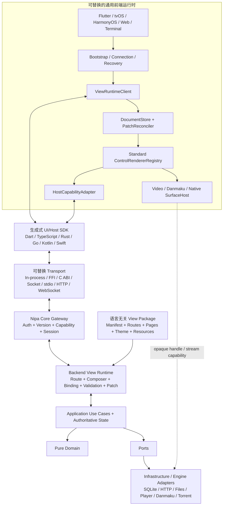

# NipaPlay 后端驱动 UI、前后端解耦与可替换运行时迁移路线图

> 状态：目标已确认 / 待执行
> 审计日期：2026-07-14
> 审计基线：`89050db2` 加当前工作区未提交修改
> 目标：页面树、布局、路由、状态绑定、校验和业务流程全部由可替换后端拥有；前端退化为通用 UI Runtime，只需实现协议、注册标准控件 renderer、宿主能力和高性能 surface，即可运行完整 NipaPlay。

## 1. 执行结论

当前项目已经具备 `Service`、`Provider`、播放器/弹幕适配器、`Unified*` 页面描述和内置 Web API 等过渡结构，但它们主要是 **Flutter/Dart 进程内部的抽象**。它们还不是稳定的跨语言、跨进程、跨前端协议。

当前主调用路径仍然是：

```text
Flutter Widget / State
  -> Provider / ChangeNotifier / static Service
  -> SharedPreferences / SQLite / HTTP / File / MethodChannel / FRB
```

目标调用路径应变成：

```text
任意通用前端运行时
  -> ViewRuntimeClient + UiDocumentReconciler
  -> ControlRendererRegistry + HostCapabilities + SurfaceHost
  -> 可替换 Transport
  -> 版本化 Core Gateway
  -> Backend View Runtime + Application Use Cases / Domain
  -> Ports
  -> 任意语言或技术实现的 Adapters
```

这里的“后端”是逻辑 Core，不等于必须部署在远程服务器。它可以是嵌入式库、本机 sidecar/daemon 或远程服务；三种形态必须实现同一协议。移动端默认优先本机嵌入或本机进程，避免把输入和播放控制绑定到公网延迟。

这次迁移采用渐进式替换，不进行一次性重写。现有 Dart 业务和页面先被包进符合新协议的 legacy adapter；每迁移一个垂直切片，就把该切片的页面组合权、业务状态和动作处理一起移入后端 View Runtime，并删除前端逐页实现。

## 2. 最终目标的准确含义

### 2.1 后端可更换语言

达到目标后，Dart、Rust、Go、Node 或其他语言实现只要：

1. 实现相同版本的协议；
2. 声明相同或兼容的 capabilities；
3. 通过同一套 conformance tests；
4. 加载或生成兼容的 View Package；
5. 遵守相同的状态机、错误码、事件顺序和数据迁移约定；

前端代码和页面结构就不需要随实现语言变化。页面定义不得只硬编码在某一种后端语言中；稳定页面应编译成语言无关的 View Package，由不同后端实现共同加载。

如果后端作为独立进程部署，可以在不修改前端源码的情况下切换实现。如果后端以静态库或 FFI 方式嵌入移动应用，替换二进制实现通常仍需要重新打包应用，但不应要求修改前端运行时代码或页面定义。

### 2.2 前端可脱离 Flutter

达到目标后，Flutter、React Native、Web 或原生前端不再包含 NipaPlay 的逐页实现，而是同一种“超级拼装器”的不同平台版本。它们只负责：

- 启动、连接后端、协议协商和 last-known-good 恢复；
- 上报 viewport、locale、输入方式、无障碍和已注册控件能力；
- 消费后端下发的 `UiBundle`、`UiSnapshot`、`UiPatch`、`ViewEffect` 和 `HostEffect`；
- 用通用 reconciler 维护 UI 文档和绑定状态；
- 将标准控件映射为 Flutter Widget、React Native Component、DOM 或原生 View；
- 执行布局求解、hit-test、焦点、滚动、手势、IME、动画和无障碍映射；
- 实现文件选择、权限、分享、窗口、剪贴板等受控 Host Capability；
- 挂载视频、音频、弹幕、DRM、PiP 等本机高性能 Surface。

前端不得包含：

- 首页、媒体库、详情、设置、下载、账户等页面专属 Widget/JSX/View；
- 应用 Route Graph、Tab/Menu 顺序、Dialog/Sheet 内容或页面布局；
- 业务可见性判断、分页/重试策略、表单业务校验、格式化和工作流；
- Feature Provider/ViewModel、Repository、Service 或供应商 DTO；
- SQLite、SharedPreferences、媒体服务器 HTTP、FRB 后端对象或静态业务单例。

前端允许内置的页面只有无法由后端提供的最小 Bootstrap Shell：启动、连接/配对、后端不可用、协议不兼容、缓存损坏恢复和开发诊断。系统权限确认仍由操作系统 UI 展示，但请求原因和后续流程由后端描述。

### 2.3 “注册控件即可分配”的含义

后端下发完整、受限、可版本化且可序列化的页面文档，而不是 Flutter Widget 名称或任意可执行 UI 代码。页面的父子结构、顺序、布局、重复模板、状态绑定和动作全部来自后端。例如：

```json
{
  "documentId": "home",
  "route": "/home",
  "revision": 42,
  "root": {
    "id": "home.page",
    "type": "standard.page",
    "children": [{
      "id": "continue.section",
      "type": "standard.section",
      "props": {"title": {"textRef": "home.continueWatching"}},
      "children": [{
        "id": "continue.grid",
        "type": "standard.virtualGrid",
        "layout": {"minItemWidth": 180, "gapToken": "space.m"},
        "repeat": {
          "source": {"binding": "state.continueWatching.items"},
          "itemKey": "id",
          "template": {
            "id": "continue.card",
            "type": "standard.card",
            "slots": {
              "media": {"id": "continue.card.image", "type": "standard.image", "props": {"source": {"binding": "item.poster"}}},
              "title": {"id": "continue.card.title", "type": "standard.text", "props": {"value": {"binding": "item.title"}}}
            },
            "events": {"press": {"actionId": "home.continue.open"}}
          }
        }
      }]
    }]
  }
}
```

各前端分别注册：

```text
Flutter:      standard.virtualGrid@1 -> FlutterVirtualGridRenderer
ReactNative:  standard.virtualGrid@1 -> RNVirtualizedGridRenderer
Web:          standard.virtualGrid@1 -> WebVirtualGridRenderer
```

普通功能必须由结构控件、输入控件、展示控件和模板组合出来，不得为“首页”“设置页”“媒体库”等注册业务页面控件。只有无法由通用布局安全高效表达的设备能力，例如 `videoSurface`、`danmakuSurface`、地图、WebView 或系统文件选择器，才允许成为高级宿主控件。

因此有一个明确发布规则：

- 使用已注册控件新增、删除、重排页面，只发布后端 View Package，不重新构建前端；
- 新增 control type 或新的宿主能力，才需要各前端增加 renderer/adapter 并发布新版本；
- optional control 缺失时使用 fallback；required control 缺失时在协商阶段阻止进入并返回可诊断错误。

### 2.4 后端拥有的 UI 职责

后端 View Runtime 是应用的 UI 作者和权威状态源，负责：

- App Manifest、Route Graph、页面、Tab、菜单、Dialog、Sheet、Toast 和 Overlay；
- 完整控件树、slots、模板、响应式变体、主题 token、资源和文案选择；
- loading、empty、error、disabled、visible、selected 等展示状态；
- 业务状态、派生状态、分页、排序、过滤、缓存、重试、权限和 feature flag；
- 表单 schema、默认值、业务校验、提交和错误映射；
- 将通用 UI Event 分发到 Use Case，并产生新 Snapshot/Patch/Effect；
- Navigation/View Session、revision、重连、回退和生命周期；
- 根据前端能力、viewport class、locale 和输入方式物化最终页面。

页面布局由后端决定，但实际像素测量由前端布局引擎完成。后端发送的是跨平台约束、token 和响应式方案，不得发送 Flutter/DOM 类名或依赖单一设备的绝对像素树。

### 2.5 前端不可避免的本机职责

以下内容保留在通用前端运行时，不算业务逻辑下沉失败：

| 本机职责 | 原因 |
|---|---|
| focus、scroll、hover、pressed、gesture、IME composing、动画进度 | 每次变化走 RPC 会破坏输入和帧率 |
| 布局测量、字体栅格、hit-test、安全区和窗口生命周期 | 依赖平台渲染引擎和实时 viewport |
| VoiceOver/TalkBack/DOM semantics、动态字体、高对比度、reduced motion | 必须映射本机无障碍 API |
| 文件、权限、分享、通知、剪贴板、窗口和安全存储 | 后端只能请求受限 capability，宿主负责授权和执行 |
| 视频/音频解码、texture、GPU 弹幕、DRM、PiP | 60fps 和受保护媒体路径不能通过普通 RPC |
| 协议校验、资源配额、缓存和崩溃恢复 | 前端必须把远程后端视为不可信输入 |

业务状态始终以后端为权威；前端瞬时状态只存在于通用 runtime。输入草稿、slider/seek 预览和 optimistic UI 的策略也必须由后端文档声明，而不是写进具体页面代码。

### 2.6 架构驱动：Apple TV、鸿蒙与低性能设备

本方案不是为了抽象而抽象，而是由以下产品约束直接驱动：

- Flutter 不能作为 NipaPlay 覆盖 Apple TV/tvOS 与鸿蒙目标的唯一前端实现；
- 旧设备不能被迫承担复杂矢量、模糊、shader 和高频自绘动画作为最低渲染基线；
- 更换前端框架时不能重新实现页面、路由、状态、验证和全部业务流程；
- 视频、遥控器焦点、系统媒体能力和平台生命周期应优先使用目标平台最成熟的原生实现。

因此 Control Contract 定义的是行为、语义、slots、状态和事件，不规定具体绘制技术。相同 `standard.button@1` 可以映射为 Flutter Widget、tvOS 原生 View、鸿蒙 ArkUI 组件或 Web DOM；不要求所有平台继续使用 Flutter/Skia 风格的矢量绘制。

建议的前端宿主矩阵：

| 目标宿主 | 建议 renderer | 重点能力 |
|---|---|---|
| 当前 Flutter 平台 | Flutter 标准控件 registry | 平滑迁移现有用户和功能 |
| Apple TV/tvOS | Swift 原生 renderer + 原生媒体 surface | 遥控器、焦点系统、十英尺界面、系统播放能力 |
| 鸿蒙 | ArkUI/ArkTS renderer + 原生媒体 surface | 原生控件、生命周期、输入和媒体能力 |
| 低性能设备 | 轻量原生 renderer 或降级 registry | 减少自绘、模糊、shader、阴影和复杂动画 |
| Web | DOM/CSS renderer | 浏览器可访问性、URL/历史和媒体能力 |

后端不得用 `platform == tvOS` 或 `platform == harmony` 在页面里硬编码分支，而应根据通用 capability 选择布局与资源，例如 `input.remote`、`navigation.focus`、`display.tenFoot`、`render.lowPower`、`visual.blur`、`visual.vectorComplexity`、`motion.level` 和 `surface.video`。这样以后增加新平台不需要修改页面协议。

图标和图片资源必须支持平台 symbol、矢量、预栅格化图片和多分辨率变体；Renderer 根据能力选择最低成本且语义一致的实现。低性能模式不是把同一复杂页面画得更慢，而是由后端下发更少节点、更轻效果和更低动画等级的等价 View Variant。

### 2.7 Headless Core、Web UI 与终端 UI

目标后端必须能够作为完全不启动 Flutter Engine 或任何图形环境的 headless Core 运行。它可以是桌面后台进程、系统服务、容器或远程服务器，并通过同一 View Runtime 协议同时服务多个前端会话。

Web UI 不是重新开发一套网页业务，而是一个通用 DOM/CSS Renderer：

```text
Headless Nipa Core
  -> HTTP/WebSocket View Runtime
  -> UiSnapshot / UiPatch / Resource
  -> Generic Web UiRuntime
  -> DOM Control Registry
  -> 浏览器操作完整应用
```

Web bundle 只包含协议客户端、DocumentStore、PatchReconciler、DOM Control Registry、浏览器 HostAdapter 和媒体 Surface；Home、Settings、Media、Download 等页面仍全部来自后端 View Package。Web renderer 可以由 Core 静态托管，也可以独立部署并连接远程 Core。

终端 UI 采用同一方式，把标准控件映射成 TUI primitives：

| 标准控件 | 终端映射示例 |
|---|---|
| page/section/row/column | screen、panel、水平/垂直布局 |
| text/list/grid/card | terminal text、table、selectable list |
| button/toggle/select/slider/textInput | key action、checkbox、menu、range、input |
| dialog/sheet/toast/progress | modal、overlay、status line、progress bar |
| image/videoSurface/danmakuSurface | capability fallback、外部打开或仅提供控制状态 |

TUI 可以完整管理媒体库、设置、历史、扫描、下载、账户和播放会话，也可以控制另一设备或本机播放器。终端不必假装支持视频像素或 GPU 弹幕；它通过 capability negotiation 获得后端生成的等价降级页面。支持 Sixel/Kitty image 等扩展的终端可以另外注册对应 capability，但不能成为协议最低要求。

多前端可以同时连接同一 headless Core。每个客户端拥有独立 ViewSession、viewport、能力和导航状态，但共享经过权限控制的业务状态；一个客户端产生的历史、下载或播放状态变化可通过后端事件更新其他客户端。

远程 Web/TUI 必须使用 pairing/auth、TLS 或受保护本机 socket、scope、origin/CSRF 防护、限流和审计。浏览器与终端不能因“是 UI”就获得任意文件路径、代理、凭据或宿主命令权限。

## 3. 当前架构审计基线

以下数字用于衡量迁移是否真的减少耦合。后续每个阶段结束时必须重新生成基线。

| 指标 | 当前值 |
|---|---:|
| `lib/` Dart 文件 | 675 |
| UI 审计范围文件 | 302 |
| UI 直接依赖核心层 import | 453 行 / 135 文件 |
| UI 直接 import `services/` | 170 行 / 75 文件 |
| UI 直接 import `models/` | 108 行 / 50 文件 |
| UI 直接 import `providers/` | 133 行 / 77 文件 |
| UI 使用 `globals.` | 217 次 / 43 文件 |
| UI 使用 `Platform.` | 118 次 / 23 文件 |
| UI 直接 import `dart:io` | 29 文件 |
| UI 使用 SharedPreferences | 35 次 / 13 文件 |
| Service 文件 | 99 |
| Service import 任意 Flutter 包 | 75 文件 |
| Service import Material/Widgets/Cupertino | 17 文件 |
| Service 使用 `BuildContext` | 10 文件 |
| Service 使用 SharedPreferences | 32 文件 |
| Service 使用 `dart:io` | 43 文件 |
| Service 使用 HTTP/Dio | 28 文件 |
| Service 导入其他 Service | 45 文件 / 96 条边 |
| Service 单例模式 | 50 文件 |
| Provider 文件 | 20 |
| Provider 直接基础设施依赖 | 16 / 20 |
| Provider 直接 SharedPreferences | 10 文件 |
| Provider 直接发 HTTP | 4 文件 |
| Model 文件 | 22 |
| Model 混入 Flutter/存储/Service | 3 文件 |
| 全项目直接 SharedPreferences import | 72 文件 |
| 全项目直接 HTTP/Dio import | 49 文件 |
| 全项目直接 Platform 判断 | 70 文件 |
| 全项目 MethodChannel/EventChannel | 12 文件 |
| `Map<String, dynamic>` 所在文件 | 176 文件 |
| Repository / UseCase / DataSource 体系 | 0 / 0 / 0 |
| `lib/data`、`lib/features/*`、`lib/presentation` | 基本为空的迁移占位目录 |
| `VideoPlayerState` 及其 part | 13,571 行 |
| 契约/协议一致性测试 | 0 |
| 非 Flutter 通用 renderer | 0 |
| tvOS 原生 / 鸿蒙 ArkUI renderer | 0 / 0 |
| 独立 headless Core 构建/启动入口 | 0 |
| 通用 Web DOM / Terminal renderer | 0 / 0 |
| remote/focus/ten-foot/low-power capability schema | 0 |
| 旧/低性能设备 renderer 性能基线 | 0 |

这些统计不是代码质量评分。它们的用途是防止“只调整目录或重命名类，但依赖方向没有改变”。

## 4. 可复用的现有基础

迁移应保留并升级下列已有设计，不应全部推翻：

- `AppPageComponent` 已有语义化页面组件 ID，可作为 Control Spec 的输入种子。
- `UnifiedAppPage` 已统一手机和桌面的主页面 ID、顺序与可用性定义。
- `PlayerMenuPaneId`、Category 和 Icon Token 已开始把菜单语义从具体图标中抽出。
- `PlayerRemoteControlBridge` 已能描述 bool、double、select、string、readonly 等参数，可演进为生成式 Command/State 协议。
- 播放器和弹幕已有多实现工厂，适合在其前方增加真正的跨语言 Port。
- Rust 文件扫描和 Torrent 已是可单独迁移的后端能力。
- C/C++ opaque handle 与显式释放函数是建立稳定本机 ABI 的良好起点。
- 内置 Shelf Web API 已证明应用可以通过传输层访问部分能力，可降级为新 Core Gateway 的一个 transport adapter。
- 插件 manifest、permission、event 和 UI entry 已有雏形，可迁移为独立 schema。

## 5. 未完全分离的架构债务清单

### D-01：Composition Root、启动编排与 UI 混在 `main.dart`

- `main.dart` 同时负责平台初始化、数据库、日志、播放器/弹幕内核、窗口、Web Server、ServiceProvider、Provider 注册、主题、拖放和主页面实现。
- `MainPageState` 仍位于入口文件；入口不是一个纯依赖装配层。
- 影响：无法独立启动 headless core，也无法为不同前端复用同一应用会话。
- 目标：创建独立 `CoreRuntime` 和纯 composition root；Flutter `main` 只装配 transport、host capabilities 和 renderer。

### D-02：全局变量、设备探测和 Navigator 是隐式依赖

- `lib/utils/globals.dart` 保存全局 Navigator、可变设置、MethodChannel 和启动设备画像。
- 设备类型主要在启动时固化，页面内仍大量直接访问 `globals.isPhone/isDesktop/isTablet`。
- 影响：依赖不可注入，窗口/折叠屏/外接显示器能力变化不能统一传播，非 Flutter 前端无法复用。
- 目标：可观察、可序列化的 `ClientEnvironment`；前端 `NavigationHost` 只执行后端导航 effect、承接系统 back/deep-link 和维护宿主历史，不拥有应用路由决策。

### D-03：所谓统一页面仍然直接构建 Flutter Widget

- `UnifiedAppPage` 保存 `IconData`、本地化闭包并提供 Widget build。
- `UnifiedAppControlRegistry` 是 enum 到具体 Flutter Page 的硬编码 `switch`，没有注册、卸载、版本或 fallback。
- `ThemeRegistry` 也是编译期 Flutter descriptor Map。
- 目标：把完整 Route Graph、页面树、布局、窗口、Action 和 Control 定义迁入后端 View Package；Widget 映射只存在于 Flutter renderer registry。

### D-04：`Unified*` ViewModel 仍不可序列化

- 设置定义保存 `BuildContext`、`IconData`、Widget builder 和 Provider 可见性函数。
- 下载 ViewModel 保存 `TextEditingController`、`VoidCallback` 和 `ValueChanged`。
- 其他统一模型仍包含前端闭包、硬编码显示字符串或 Flutter foundation 类型。
- 目标：删除前端业务 ViewModel；后端输出完全可序列化的 `ViewSnapshot/ViewPatch`，前端仅保留通用 `DocumentStore` 和瞬时渲染状态。

### D-05：UI 直接调用 Service、Provider、Model 和基础设施

- 75 个 UI 文件直接 import `services`；典型高耦合文件包括首页、媒体库、详情页、下载页和播放器菜单。
- 页面自己加载数据、保存偏好、发 HTTP、访问文件、判断平台、维护 Timer 和业务缓存。
- 目标：通用 renderer 只消费 `UiDocument + resolved props`，统一发出 `UiEvent`；前端不再存在逐页 Widget、业务 Command 映射、持久化、网络或领域 Service。

### D-06：手机与桌面共享页面 ID，但不共享应用状态宿主

- 桌面 `MainPageState` 与手机 `CupertinoMainPageState` 分别维护页面选择、监听器、功能可见性和生命周期。
- 桌面预创建页面，手机切换时可能让 StatefulWidget 离树重建。
- 目标：后端维护 `ApplicationSession/ViewSession/RouteState`；所有前端只维护同一种通用文档存储，renderer 切换不得触发业务重载。

### D-07：Flutter Material 与 Cupertino renderer 互相反向依赖

- Cupertino 主题直接使用 Nipaplay 主题组件，Nipaplay 主题也直接使用 Cupertino sheet、dialog 和 toolbar。
- 目标：两个 renderer 零互相 import；共用视觉 primitive 放入独立 Flutter-only primitives 包，业务语义放 contracts。

### D-08：Provider 同时承担状态、Repository、网络、持久化和业务编排

- 20 个 Provider 中 16 个直接依赖基础设施。
- `WatchHistoryProvider` 同时访问 SQLite、文件、ScanService 和 Web API。
- Jellyfin、Emby、Dandanplay、共享库 Provider 内有 Web/Native 分支和直接 HTTP。
- 目标：所有 Feature Provider/ViewModel 最终归零；Flutter 只保留一个通用 `ViewRuntimeStore`，负责 session、snapshot、patch、effect 和本地瞬时状态。

### D-09：Model、数据库、迁移和同步混在同一层

- `WatchHistoryManager` 同时承担实体、静态缓存、JSON 文件、SQLite 迁移和同步触发。
- `WatchHistoryDatabase` 位于 `models` 并直接处理文件、FFI、Preferences 和迁移。
- 远程共享模型在 `fromJson` 中按 Web 平台改写 URL。
- 目标：区分 Domain Entity、供应商 DTO、Contract Message、View State、Repository Port 和 Adapter。

### D-10：供应商 DTO 直接成为前端领域模型

- Jellyfin、Emby、Bangumi/Dandanplay 的原始字段、大小写和 URL 进入共享 Model 和 UI。
- Jellyfin/Emby Provider、Service、匹配器存在大量平行代码。
- `jellyfin://`、`emby://`、`webdav://`、`smb://` 字符串协议散落在业务判断中。
- 目标：供应商 DTO 只允许存在于 adapter；核心使用统一 `MediaItem/MediaSourceRef/PlaybackSource`。

### D-11：Service 是巨型混合层，并形成横向依赖网

- Service 混合 HTTP、缓存、偏好、重试、平台、业务规则和状态通知。
- 45 个 Service 直接导入其他 Service，Service 与 Provider 还存在双向依赖。
- 扫描、媒体服务器、备份、弹弹play、WebDAV、SMB 等模块均有此问题。
- 目标：Application Use Case 负责编排；Port 描述依赖；Adapter 只实现单一外部能力。

### D-12：Service 反向依赖 Flutter UI

- PlaybackService 直接导航和读取 Provider。
- 自动下一集、匹配、退出、扫码、外部播放器等 Service 接收 `BuildContext` 或显示 Dialog/Snackbar。
- Jellyfin/Emby matcher 甚至在 Service 文件中声明完整 Widget。
- 目标：Service 只返回领域结果；Navigate、Dialog、Sheet、Toast 等进入后端 View State/Effect，前端通用 runtime 负责呈现。只有文件、权限、分享、剪贴板、窗口等 OS 能力使用 `HostEffect`。

### D-13：静态 Service Locator 和单例阻止实现替换

- `ServiceProvider` 静态创建 Provider 与 Service。
- 约 50 个 Service 使用 `instance` 或工厂单例；工厂内部又读取 SharedPreferences 和平台状态。
- 目标：所有实例只在 composition root 创建；构造函数依赖 Port；测试、legacy、Rust 或远程实现可注入替换。

### D-14：`VideoPlayerState` 是 UI、业务和基础设施的超级对象

- 主文件和 part 合计 13,571 行。
- 同时包含 Flutter Widget/Navigator、播放器实例、网络、数据库、Preferences、文件、字幕、弹幕、同步、平台窗口、屏幕亮度和音量逻辑。
- `PlayerRemoteControlBridge` 也直接绑定该 Flutter 状态对象。
- 目标：拆为 `PlaybackSession` 状态机、Use Cases、Engine Port、Preference Port、Sync Port、Host Effect 和前端 Store。

### D-15：播放器抽象仍是 Flutter SPI，不是跨语言协议

- `AbstractPlayer` 暴露 Flutter `ValueListenable`。
- Player wrapper 返回 Widget、Rect、VideoPlayerController，并通过 `dynamic` 探测实现能力。
- Factory 同时负责 Preferences、平台判断和具体实例创建。
- 目标：定义语言无关的 `PlayerSession` Command/State/Event；Surface 通过 opaque handle/capability 单独挂载。

### D-16：弹幕领域、布局算法和 Flutter 渲染没有分开

- `DanmakuContentItem` 使用 Flutter `Color`。
- `DanmakuTextRenderer` 接收 `BuildContext` 并返回 Widget。
- Overlay 通过巨型 `switch` 选择 CPU/GPU/Canvas/C++/Rust 实现。
- 目标：纯 `DanmakuItem`、`DanmakuLayoutEnginePort`、帧数据协议和每个前端的 Presenter/Surface adapter。

### D-17：FRB、MethodChannel 和手写 FFI 被当成公共契约

- FRB 生成类只能直接被 Dart/Flutter 消费。
- Torrent Rust API 多处返回 JSON 字符串；Next2 用松散 Map/JSON 和 Flutter 类型拼装数据。
- MethodChannel 名称、方法名和 Map payload 缺少 schema、版本和 capability negotiation。
- C ABI 尚缺统一 ABI 版本协商、`struct_size`、保留字段、线程模型和签名漂移测试。
- 目标：这些全部降级为 transport/engine adapter；公共契约由独立 IDL/schema 定义。

### D-18：平台能力散落在 Service、Utils、Widget 和原生 Runner

- 文件选择、SAF、照片、分享、安全书签、关联文件、窗口、托盘和视频纹理分别使用不同字符串 Channel。
- 目标：统一 `HostCapabilities`；Flutter、React Native、Web 和原生前端各自实现。后端只能请求带 scope 的 OS 语义 effect，不能直接调用平台 API。

### D-19：内置 Web API 不是稳定的 NipaPlay 后端协议

- 路由无统一 `/v1`、schema、生成客户端、能力协商或统一错误 envelope。
- Shelf Controller 直接访问 ServiceProvider、Provider、文件系统和具体 Service。
- `Map<String, dynamic>` 与手工 JSON 映射大量存在。
- 目标：schema-first 的 Core Gateway；Shelf 只是其 HTTP/WS adapter。

### D-20：Web/Native 差异被写进 Provider 和业务 Model

- 多个 Provider 通过 `kIsWeb` 决定直接调用本地 Service 还是远程 HTTP，再手工映射不同数据。
- 目标：前端只依赖同一 `ViewRuntimeClient`；差异由 `EmbeddedTransport`、`LocalTransport` 与 `RemoteTransport` 处理。

### D-21：插件系统混合运行时、存储、网络、业务、权限和 Flutter UI

- PluginService 保存静态 `dynamic playerState` 和 `BuildContext`。
- 插件桥通过字符串 switch 直接控制 Flutter VideoPlayerState、UI 和 Preferences。
- manifest 缺少 schemaVersion、运行时兼容范围、UI slot、控件版本和签名信息。
- UI entry 只支持 action/switch/text，Event 只有字符串和 Map。
- 部分权限主要在注入的 JS wrapper 检查，宿主分发端必须增加不可绕过的强制校验。
- 目标：插件只向后端注册 capability/use case/state/View Package contribution；前端仍只渲染标准控件。宿主端强制权限、配额、取消、超时和隔离。

### D-22：设置、凭据、备份和本地化边界不清

- 72 个文件直接 import SharedPreferences，设置 key 和 enum index 分散。
- WebDAV、SMB、媒体服务器凭据由普通 Preferences/JSON 模型持有。
- 备份通过扫描 key 前缀推断数据分类。
- 核心/统一模型中存在硬编码中文显示文本。
- 目标：Typed Settings Schema、CredentialVaultPort、版本化 Backup Schema；后端选择文案并返回 `LocalizedText`，或下发可独立更新、带完整性校验的语言包，前端不得编译页面专属应用文案。

### D-23：错误、取消、重试、事件顺序和状态恢复没有统一协议

- 异常常被转换成自由文本或 `Map<String,dynamic>`。
- Event 缺少 eventId、sequence、revision、重放和背压约定。
- 长任务缺少统一 commandId、取消、幂等键和恢复查询。
- 目标：稳定错误码、请求关联 ID、幂等语义、Snapshot + Revision + Patch/Event 流。

### D-24：安全边界不足以直接开放可替换远程后端

- LAN API 需要统一 pairing/session、scope、限流、body 上限和审计。
- Web UI proxy 可代理任意 HTTP/HTTPS 并转发请求头，存在 SSRF、开放代理和凭据转发风险。
- Rust Torrent Range 服务也需要短期 token、生命周期和访问范围约束。
- 目标：安全问题作为 P0 阻断项，未完成前不得把内部 API 宣告为正式 Core Gateway。

### D-25：测试只能证明 Flutter/Dart 内部行为

- 现有测试没有 contract fixture、跨语言 codec、transport conformance 或第二前端测试。
- 部分架构测试通过读取源码字符串断言实现细节，不能证明协议兼容性。
- 目标：同一 conformance suite 覆盖 legacy、fake、Rust/第二语言、embedded/remote transport，以及 Flutter/第二前端的 Snapshot、Patch、UiEvent 和 accessibility 语义。

### D-26：仓库和包结构仍以单体 Flutter 应用为中心

- `lib/data`、`lib/features/*` 和 `lib/presentation` 尚未承载真实分层。
- Core、Contracts、Adapters、Frontend 无独立发布/编译单元。
- 目标：形成可单独构建的 contracts、core、adapter 和 frontend workspace。

### D-27：UI 组合权仍然属于 Flutter

- 当前 Page、Route、Tab、Menu、Dialog、Sheet、loading/empty/error、表单规则、显示条件和应用文案仍主要写在 Flutter/Dart 中。
- 即使数据访问全部迁出，只要这些内容还在 Flutter，tvOS、鸿蒙、React Native/Web 前端仍需重新实现整套应用。
- 目标：上述内容全部迁入语言无关 View Package 和后端 View Runtime；前端 feature page、feature route、业务 ViewModel、业务条件和页面专属布局组件最终为 0。

### D-28：平台覆盖、输入模型与渲染成本被 Flutter 实现锁定

- 当前控件、主题、页面、焦点、输入和绘制策略以 Flutter 支持的平台与渲染路径为默认前提。
- 尚无 tvOS 原生 focus/remote renderer、鸿蒙 ArkUI renderer 或 low-power renderer conformance；旧设备也缺少节点、矢量、blur/shader 和动画预算。
- 如果协议继承 Flutter Widget、Canvas 或视觉效果假设，即使业务迁到后端，目标平台仍无法选择原生、轻量的绘制路径。
- 目标：Control Contract 只定义语义和行为；用 capability 描述 remote/focus/ten-foot/render tier，允许 tvOS、鸿蒙和低性能设备采用完全不同的原生控件、媒体 Surface 和栅格资源。

### D-29：Core 尚不能作为多客户端 headless 应用运行

- 当前启动、ServiceProvider、Provider、页面状态和部分 Web Controller 仍依赖 Flutter 应用进程，缺少无图形环境的独立 Core 入口。
- 现有 Web API 只暴露部分手写功能，不会下发完整页面、导航、表单、状态绑定和 Patch；也没有通用 Terminal renderer。
- 业务状态与 Flutter Widget 生命周期绑定，无法让 Web、TUI、电视和桌面客户端同时维护独立 ViewSession 并共享同一 Core。
- 目标：独立 headless daemon/server + 多会话 View Runtime；Web DOM 与 TUI 都只注册标准控件，不复制页面或业务。

## 6. 目标架构



一句话定义：**后端输出 Virtual View Tree，前端实现 Host Renderer；后端拥有应用，前端只拥有设备。**

### 6.1 允许的依赖方向

```text
frontend bootstrap/reconciler/renderer -> generated view/host sdk
view package                         -> ui schema + resource schema
backend view runtime                 -> application + ui schema
application                          -> domain + ports
adapters                             -> ports + generated contracts
transport                            -> generated contracts + gateway
domain                               -> 标准库或纯语言基础包
```

禁止：

```text
domain/application -> Flutter / React Native / Provider / Widget
domain/application -> SQLite / SharedPreferences / HTTP / File / MethodChannel / FRB
service/adapter     -> page / widget / theme / Navigator / BuildContext
frontend            -> application use case / concrete service / database / supplier DTO
frontend            -> feature page / feature route / business validation / business formatter
renderer            -> backend command name / action implementation / arbitrary expression
renderer A          -> renderer B
```

前端唯一业务入口是 `ViewRuntimeClient`。Renderer 只能接收已校验的 props、slots、事件发射器、主题 token 和宿主上下文；不能绕过 View Runtime 调用 Core Use Case。

### 6.2 建议的目标仓库结构

```text
contracts/
  proto/nipaplay/v1/
  ui-schema/v1/
  resource-schema/v1/
  plugin-schema/v1/
  control-contracts/
  fixtures/
  generated/
view-package/
  app-manifest/
  routes/
  pages/
  themes/
  localization/
  assets/
  compiled/
backend/
  domain/
  application/
  ports/
  gateway/
  view-runtime/
  headless-daemon/
adapters/
  legacy_dart/
  rust/
  persistence_sqlite/
  media_jellyfin/
  media_emby/
  webdav/
  smb/
  platform/
frontends/
  flutter/
  tvos_native/
  harmony_arkui/
  low_power_reference/
  react_native_reference/
  web_dom/
  terminal_tui/
tools/
  architecture_checks/
  view_package_compiler/
  conformance/
```

稳定页面优先以 JSON/YAML/IDL 编写并编译成 canonical View Package，不分别硬编码在 Dart、Rust、Go 中。这样替换后端语言时可以复用同一页面定义。动态页面仍可由后端 View Composer 生成，但必须输出同一种协议。

迁移初期可以先放在 `packages/` 下，等依赖边界稳定后再移动现有 Flutter app，避免为了目录美观造成大规模无功能变更。

### 6.3 协议技术决策

推荐：

- Session、业务消息、UI Event、Patch、Effect：以 Protobuf 为事实源，生成 Dart、TypeScript、Rust、Go、Kotlin、Swift 类型。
- View Package、Control Contract、Plugin Manifest：使用带版本的 JSON Schema；构建时编译、校验、生成 hash，并可转成 canonical binary。
- 动态 props 使用带 tag 的 `UiValue` 和控件专属 schema，禁止用无约束 `Map<String,dynamic>` 作为公共接口。
- HTTP 控制面：版本化 `/v1`，可采用 Connect/JSON transcoding；不得手写一套与 IDL 不一致的 Map。
- 本机 headless/TUI 可以使用受保护的 Unix socket、named pipe 或 stdio transport，但消息和状态机必须与 HTTP/WS 相同。
- UI Update：WebSocket、server stream 或等价传输，但必须使用同一 revision/sequence schema。
- 媒体数据面：HTTP Range、共享内存、二进制 buffer 或 native surface；不得把视频帧塞进普通 JSON RPC。
- 本机高性能边界：C ABI/FFI，增加 ABI version、capability、`struct_size`、线程、所有权和释放规则。
- 不允许下发 JavaScript、Dart、Lua、任意 HTML、动态类名、反射调用或其他可执行页面代码。

如果团队不采用 Protobuf，最低替代方案是 OpenAPI 3.1 + AsyncAPI + 共享 JSON Schema；无论选哪种，都必须先改 schema，再生成代码，禁止继续以手写 `Map<String,dynamic>` 作为公共接口。

### 6.4 View Runtime 最小协议

```text
System.NegotiateProtocol
System.GetCapabilities
UI.CreateSession
UI.ReportEnvironment
UI.OpenView
UI.GetSnapshot
UI.SubscribeUpdates
UI.DispatchEvent
UI.CompleteEffect
UI.ResolveRoute
UI.ResumeSession
UI.Resync
UI.CloseView
UI.ReportRenderFailure
Resource.Resolve
Settings.Get / BatchSet / Watch
History.List / Upsert / Delete / Watch
Media.ListLibraries / Query / GetDetail
MediaSource.Browse / ResolvePlayback
Scan.Start / Cancel / GetState
Playback.CreateSession / Prepare / Command / GetState / Subscribe
Danmaku.Search / Match / Load / Send
Account.Connect / Disconnect / GetState
Download.Add / Command / List / Watch
Backup.Export / Import
Events.Subscribe
```

统一 envelope 至少包含：

```text
request:  protocolVersion, requestId, method, deadline, idempotencyKey, payload
response: requestId, revision, data | error(code, messageKey, details, retryable)
event:    eventId, sequence, revision, timestamp, type, payload
```

标准运行流程：

1. 前端发送协议范围、Control Contracts、Host Effects、Surface、环境和资源限制；
2. 后端协商版本，创建 `UiSession` 并返回 resume token；
3. 前端发送 route/deep-link，后端返回完整 `UiSnapshot`；
4. 通用 reconciler 校验文档并根据 registry 拼装页面；
5. 用户操作只产生标准 `UiEvent`；
6. 后端鉴权、校验、执行 Use Case，返回原子 `UiPatch`、导航或 Host Effect；
7. 长任务通过 update stream 持续推送；
8. revision 不匹配时执行 `Resume/Resync`，不能猜测或静默覆盖。

### 6.5 首批核心 Ports

- `WatchHistoryRepository`
- `SettingsRepository`
- `CredentialVaultPort`
- `MediaCatalogRepository`
- `MediaServerGateway`
- `RemoteFileSystemPort`
- `DanmakuGateway`
- `BangumiGateway`
- `PlaybackEnginePort`
- `DownloadEnginePort`
- `FileScannerPort`
- `ThumbnailStore`
- `BackupStore`
- `NetworkTransport`
- `Clock`
- `IdGenerator`
- `EventPublisher`
- `HostCapabilitiesPort`

### 6.6 View Package 与页面文档

```text
UiBundle {
  bundleId, version, protocolRange, uiSchemaRange
  appManifest, routeGraph, pageTemplates
  themePacks, localizationPacks, assetManifest
  requiredControls, requiredHostCapabilities
  offlinePolicy, integrityHash, signature
}

UiDocument {
  documentId, instanceId, route, revision, environmentRevision
  rootNodeId, nodes, state, collections, forms, actions, resources
  themeRef, navigationState, policies, checksum
}
```

`nodes` 应在传输层规范化为 `nodeId -> ControlNode`，避免深层数组树导致补丁只能依赖脆弱的数组下标。View Package 可以保留便于作者阅读的嵌套语法，但编译器必须产生稳定 node ID 和规范化结果。

后端拥有 Route Graph 和导航决策；前端只执行 `push/replace/pop/reset/present/dismiss` 等语义 effect、维护系统历史，并把 back/deep-link 上报后端。Route ID 不能是 Flutter/RN 页面类名。

### 6.7 Control Registry、布局与能力协商

```text
ControlNode {
  id, type, controlVersion
  props, bindings, eventBindings
  slots, children, repeat, itemTemplate
  layout, responsiveVariants, styleTokens
  visible, enabled, focus, keyboard, gesture, animation
  accessibility, requiredCapabilities, fallbackNodeId
}

ControlContract {
  type, supportedVersions, schemaHash
  propsSchema, events, slots, supportedBindings
  requiredHostCapabilities, accessibilityContract, fallbackType
}

LayoutSpec {
  display, size, minMax, aspectRatio
  flex, grid, padding, margin, gap
  align, justify, overflow, scroll, order
  variants
}

ClientEnvironment {
  viewport, safeArea, displayClass, viewingMode
  inputModes, focusModel, locale, accessibility
  renderProfile, resourceFormats, surfaceCapabilities
}

RenderProfile {
  performanceTier, maxNodeBudget
  vectorComplexity, animationLevel
  supportsBlur, supportsShader, supportsRasterCache
}
```

首版内置控件建议：

- 布局：page、safeArea、scroll、row、column、stack、grid、virtualList、virtualGrid、spacer、divider、section、focusScope；
- 展示：text、icon、image、badge、progress、card；
- 输入：button、iconButton、textInput、toggle、checkbox、radio、select、slider；
- 容器呈现：tabs、dialog、sheet、menu、errorBoundary；
- 高性能：videoSurface、danmakuSurface；
- 容错：unknown、unsupported、fallback。

必须满足：

- 后端不发送 Widget 名、平台组件名或闭包；
- 页面布局、顺序、slots、repeat/template 和 responsive variants 全部由后端定义；
- Action 只引用当前 session 签发的不透明 `actionId`；renderer 不知道业务 command；
- 图标使用语义 token；
- 文本使用后端选择的 `LocalizedText` 或后端下发的语言包；
- 未知控件显示安全 fallback 并上报 capability mismatch；
- required control 在启动协商时缺失，应阻止进入相关页面并给出可诊断错误；
- 插件不能绕过 registry 注册任意原生执行代码。

前端 `ClientHello` 至少上报：协议/UI schema 范围、每个 control 的版本与 schema hash、Host Effects、Surfaces、layout features、资源格式、locale、viewport/safe-area、remote/pointer/touch/keyboard、focus model、display/viewing mode、render profile、主题/无障碍偏好和本机资源上限。

后端可以下发 `compact/medium/expanded`、`focus-navigation`、`ten-foot`、`low-power` 等受限 capability variants，由通用 runtime 即时匹配；前端不得编写 NipaPlay 专属 breakpoint 或平台业务分支。环境结构性变化仍需上报后端，由后端决定是否生成新快照或补丁。

### 6.8 状态绑定、表单和事件

```text
Binding {
  target, source
  mode: read | draft
  update: input | change | commit
  debounceMs, fallback, converter
}

ActionRef {
  id, eventType, payloadSchemaRef
  delivery, concurrency, offlinePolicy, expiresAt
}

UiEvent {
  eventId, sessionId, documentInstanceId, documentRevision
  nodeId, actionId, eventType, payload
  clientSequence, timestamp, idempotencyKey
}
```

只允许白名单通用 converter，例如 duration/number/date 格式化、boolean not、equals 和 text interpolate；不允许任意表达式或脚本。业务派生值由后端计算后写入 state。

前端可以为了即时反馈执行后端声明的 required/min/max/length/enum 等标准表单约束，但后端必须再次权威校验；跨字段、权限、唯一性和业务规则只在后端执行。敏感字段不得进入日志、持久缓存、截图或诊断上报。

后端收到事件时必须验证 action 属于当前 session、document、node、event 和 revision，payload 符合 schema，且当前用户仍有权限。前端不能通过伪造 action ID 直接调用任意 Use Case。

### 6.9 Snapshot、Patch、导航与 Host Effect

```text
UiUpdate {
  updateId, sessionId, instanceId
  baseRevision, targetRevision, serverSequence
  atomic, patches, effects, ackEventIds, checksum
}

PatchOp = putNode | removeNode | setNodeProp | spliceSlot | moveNode
        | setState | removeState | putCollectionItems
        | removeCollectionItems | setFormErrors | useTheme
        | invalidateResource
```

- 一批补丁必须以 `baseRevision` 为前置条件并原子应用；
- 列表按稳定 item key 更新，禁止用数组下标作为身份；
- effect 通过 `effectId` 保证至多执行一次；
- 补丁过大或 revision/checksum 不匹配时返回完整 Snapshot；
- 断线恢复发送最后 revision、server sequence 和未确认 event；
- 删除节点必须同时回收 action、binding、draft 和 surface 生命周期。

Dialog、Sheet、Toast、Menu 和导航内容属于 View Protocol。只有 OS 级能力使用白名单 `HostEffect`，例如 filePicker、directoryPicker、permission、share、clipboard、notification、openExternalUri、window 和 attachSurface。结果通过 `UI.CompleteEffect` 返回后端；文件优先返回 scoped opaque handle 或上传流，不能把任意本机路径暴露给远程后端。

### 6.10 视频和弹幕的特殊边界

播放器不能简单全部远程化。必须拆为：

1. 控制面：Prepare、Play、Pause、Seek、Track、State、Event；
2. 媒体数据面：Range URL、buffer 或解码输入；
3. 本机呈现面：texture/surface/opaque handle；
4. 宿主生命周期：attach、resize、detach、foreground/background；
5. 弹幕布局面：纯 item + layout output；
6. 弹幕呈现面：Flutter Canvas、RN Fabric/JSI、Web Canvas/WebGPU 或 native GPU adapter。

页面中 `videoSurface`/`danmakuSurface` 的位置、尺寸、可见性、菜单和动作仍完全由后端文档决定。解码、texture、字体测量、GPU 绘制和帧同步在本机 SurfaceHost 执行。

高频路径必须有二进制协议、共享内存、Wasm/native engine 或 surface 方案，不能逐帧传未版本化 JSON。远程后端只提供可访问的 media stream/range 和批量 timeline data，不能跨机器传 texture handle。

### 6.11 性能、离线、无障碍与零信任边界

- 60fps 路径不得跨普通 RPC；长列表必须 virtualized/lazy；patch apply 和布局提交必须有单帧预算。
- Renderer 可以并应优先映射为平台原生控件；协议不要求 Flutter Canvas、统一矢量引擎或逐像素相同的绘制路径。
- `low-power` profile 必须限制节点预算、矢量复杂度、blur/shader、阴影层数和动画等级，并优先选择预栅格化、多分辨率资源。
- textInput 使用本地 draft，按后端声明 debounce/commit；slider/seek 可本地预览并节流提交。
- P0 基线后设置门槛：本机 Core 交互 ack 建议 p95 小于 50ms，远程交互 ack 建议 p95 小于 150ms；超限必须使用 optimistic policy 或改成本机能力。
- 前端缓存带 hash/signature 的 last-known-good UiBundle、资源、语言包和允许的 snapshot；Action 明确 `local-only/queueable/online-required`，可排队动作必须幂等。
- 飞行模式冷启动、Core 重启、断网队列、缓存损坏、版本升降级和 revision 冲突必须有恢复测试。
- 每个交互控件缺少 role/name/action 时 schema 校验失败；键盘、VoiceOver/TalkBack、200% 字体、高对比度和 reduced motion 必须由 renderer conformance 覆盖。
- tvOS/遥控器宿主必须覆盖 focus graph、preferred focus、方向移动、select/menu/back 和十英尺布局；这些由标准 focus/interaction schema 描述，由原生焦点系统执行。
- 前端必须把后端文档视为不可信输入：限制文档字节、节点数、深度、children 数、字符串/资源大小和 patch 频率；白名单 control/prop/effect/URL scheme/domain，禁止 eval、任意 HTML、任意文件路径和下载执行代码。
- Host Effect 使用 scope token、用户手势和必要确认；凭据只传 secret reference；网络 transport 必须认证、加密、防重放、限流并记录安全审计。

## 7. 待办执行流程

### 7.1 单个待办的标准流程

每个待办必须按以下顺序执行：

1. 关联一个 `D-xx` 架构债务和一个可观察用户流程；
2. 添加 behavior、visual、accessibility characterization/golden tests，冻结现有行为；
3. 先定义或扩展业务 contract、View Package 和 Control Contract，并生成客户端/服务端类型；
4. 定义 Port 和 fake/in-memory 实现；
5. 用 legacy core/view adapter 包装现有业务和页面行为；
6. 后端生成该切片的 Snapshot/Patch，通用前端只通过 registry 渲染和发送 UiEvent；
7. 必要时 shadow read、dual write 或并行比对；
8. 通过 contract、action trace、renderer、accessibility、integration、security、performance 和数据迁移测试；
9. 删除该切片的旧直连路径以及前端 feature page/route/view-model；
10. 更新本文基线、依赖图和完成状态。

禁止在一个 PR 中同时迁移多个高风险领域。正常 PR 应只包含一个 contract 变更、一个 adapter 或一个垂直切片。

### 7.2 状态定义

| 状态 | 含义 |
|---|---|
| TODO | 未开始，依赖条件可能尚未满足 |
| READY | contract、owner、验收标准和依赖已明确 |
| IN_PROGRESS | 正在实现；只能有一个明确主路径 |
| BLOCKED | 阻断原因和解除条件已记录 |
| VERIFYING | 实现完成，正在跑一致性/迁移/性能测试 |
| DONE | 旧路径已删除，退出门槛全部满足 |

## 8. 分阶段 TODO

## P0：安全、冻结边界与基线

- [ ] `P0-01` 编写 ADR：强 Server-Driven UI 权责、View Package 事实源、版本策略、embedded/local/remote transport、前端最小例外和插件信任模型。
- [ ] `P0-02` 建立 endpoint、command、event、setting key、MethodChannel、FFI/FRB API、control ID 全量清单。
- [ ] `P0-03` 建立 Page、Route、Tab、Menu、Dialog、Sheet、表单规则、显示条件、应用文案和业务 ViewModel 全量清单。
- [ ] `P0-04` 把第 3 节统计做成 `tools/architecture_checks` 可重复脚本并在 CI 输出趋势。
- [ ] `P0-05` CI 禁止新增 UI -> Service/Provider/IO 直连，先采用“不得高于基线”的 ratchet，再逐步降到 0。
- [ ] `P0-06` CI 禁止新增 feature page、feature route、页面专属布局组件、业务 formatter/validator 和前端业务条件。
- [ ] `P0-07` CI 禁止新建 Service 使用 BuildContext/Widget/Navigator/Theme/Dialog/Snackbar。
- [ ] `P0-08` 为现有 API、Channel、FRB、UI 页面行为和插件 payload 建立 golden fixtures。
- [ ] `P0-09` 给 LAN API 增加统一 pairing/session、scope、CORS allowlist、限流、body 上限和审计日志。
- [ ] `P0-10` 限制 Web UI proxy 的 scheme、host、端口、私网范围和敏感 header，加入 SSRF/开放代理测试。
- [ ] `P0-11` 为 Torrent Range endpoint 增加短期 token、绑定范围和生命周期清理。
- [ ] `P0-12` 在主力设备和至少一台旧/低性能设备上记录启动、首屏、列表滚动、复杂矢量、blur/shader、输入、patch、播放控制和弹幕性能基线。
- [ ] `P0-13` 记录键盘、遥控器焦点、VoiceOver/TalkBack、动态字体、高对比度和 reduced motion 的交互/无障碍基线。
- [ ] `P0-14` 建目标宿主能力矩阵：Flutter、tvOS 原生、鸿蒙 ArkUI、Web 和 low-power renderer 的 controls/effects/surfaces/resources。
- [ ] `P0-15` 盘点 headless 启动对 Flutter/窗口/Provider 的依赖，并定义 Web/TUI pairing、origin、scope、socket 权限和多客户端威胁模型。

退出门槛：

- 所有现有外部/内部接口均有稳定 ID、owner 和 fixture；
- 未认证客户端不能修改设置、读取凭据或使用任意代理；
- 新 PR 无法继续增加已知逆向依赖或新的 Flutter 页面组合权；
- 本阶段不要求改变用户可见功能。

## P1：语言中立 Contracts 与生成式 SDK

- [ ] `P1-01` 创建 `contracts/proto/nipaplay/v1` 和包级版本规则。
- [ ] `P1-02` 定义 Meta、Version、Capability、Request/Response、Error 和 Event envelope。
- [ ] `P1-03` 定义 cancellation、deadline、idempotency、revision、sequence、snapshot/patch、ack 和重连续传规则。
- [ ] `P1-04` 定义 System、Settings、History 的首批协议。
- [ ] `P1-05` 定义 Media、MediaSource、Playback、Danmaku、Download 的 ID 与基本消息，不必一次实现全部方法。
- [ ] `P1-06` 创建 `ui-schema/v1`：UiBundle、AppManifest、RouteGraph、UiDocument、ControlNode、LayoutSpec、ResponsiveVariant、ClientEnvironment、RenderProfile、Theme、LocalizedText、Asset 和 Accessibility。
- [ ] `P1-07` 定义 ViewSession、ClientHello/ServerHello、UiSnapshot、keyed UiPatch、UiEvent、ActionRef、NavigationEffect、HostEffect 和 EffectResult。
- [ ] `P1-08` 定义 Binding、Form、Validation、Collection、Pagination、AsyncState、Draft、Optimistic 和 Offline Policy。
- [ ] `P1-09` 创建 ControlContract schema、首批标准控件契约、focus/remote interaction、schema hash 和 capability negotiation。
- [ ] `P1-10` 创建 View Package compiler：校验、规范化 node ID、hash、签名、资源清单和 canonical 输出。
- [ ] `P1-11` 创建 `plugin-schema/v1`：manifest、permission、runtime、contribution、slot、control 和 event。
- [ ] `P1-12` 生成 Dart、TypeScript/ArkTS、Rust 和 Swift SDK；预留 Go/Kotlin 生成配置。
- [ ] `P1-13` 建跨语言 fixture/codec、action trace、patch trace 和 schema backward-compatibility 检查。
- [ ] `P1-14` 将错误和文案改成稳定 `LocalizedText`；后端选择文案，或下发可更新的语言包。
- [ ] `P1-15` 固化树深、节点数、props/资源大小、patch 频率、URL/effect allowlist 等协议安全上限。

退出门槛：

- contracts 可在没有 Flutter SDK 的环境编译和测试；
- Dart、TypeScript、Rust 对同一 fixture 编解码一致；
- 一份完整 Settings View Package 能通过编译器并生成确定性相同的 canonical 输出；
- public contract 中不存在 Widget、Color、IconData、BuildContext、ValueListenable、Controller、闭包或 Dart-only 类型；
- unknown field、unknown optional control 和 minor version 升级通过兼容测试；
- malformed tree、恶意 URL、超大资源和非法 effect 在进入 renderer 前被拒绝。

## P2：Core Gateway、依赖注入与 Legacy Adapter

- [ ] `P2-01` 定义唯一前端业务入口 `ViewRuntimeClient`；前端不得直接获得 Application/CoreGateway client。
- [ ] `P2-02` 实现 `LegacyDartCoreAdapter + LegacyViewComposer`，先包装现有 Service/Provider，再输出标准 UiSnapshot/Patch。
- [ ] `P2-03` 实现 `FakeCoreBackend`，供 UI、contract 和故障测试使用。
- [ ] `P2-04` 实现 `EmbeddedTransport` 与版本化 HTTP/WS transport，共用同一生成接口。
- [ ] `P2-05` 创建实例化 `AppKernel`；逐步替代 `ServiceProvider` 静态 Service Locator。
- [ ] `P2-06` 引入 `Clock`、Logger、IdGenerator、EventPublisher 和 CancellationToken Port。
- [ ] `P2-07` 在后端建立 `ApplicationSession + ViewSessionManager + RouteState + PatchEngine`。
- [ ] `P2-08` 在 Flutter 建立通用 `DocumentStore + PatchReconciler + EffectDispatcher`，不得包含页面 ID switch。
- [ ] `P2-09` 建立 ViewEffect/HostEffect 通道：Navigate/Dialog/Sheet/Toast 属于 View；FilePick/Permission/Share/Window 属于 Host。
- [ ] `P2-10` 完成 session resume、revision mismatch、全量 resync、event replay 和 effect 去重。
- [ ] `P2-11` 建立不链接 Flutter Engine 的 headless Core 可执行入口，支持本机 socket/stdio 与 HTTP/WS transport。
- [ ] `P2-12` 支持多客户端 ApplicationSession/ViewSession：独立导航和能力、共享授权业务状态、跨客户端事件同步。

退出门槛：

- Flutter 通用 runtime 至少可通过 legacy、fake 两种 backend 运行同一份完整 Settings UiSnapshot；
- 相同测试可对 Embedded 与 HTTP/WS transport 执行；
- Settings renderer 不直接引用具体 Service、Provider、setting key 或页面 command；
- 修改 snapshot 中的 section 顺序，不改 Flutter 源码即可改变页面；
- Service 不再为已迁移流程直接操作 UI；
- headless Core 可在无窗口、无 Flutter SDK/Engine 的环境启动，并由测试客户端完成 Settings 流程。

## P3：数据、设置、凭据与供应商 Adapter

- [ ] `P3-01` 建立 `SettingsRepository` 和 typed settings schema，迁移散落 key 与 enum index。
- [ ] `P3-02` 建立 `CredentialVaultPort`，迁移 WebDAV、SMB、Jellyfin、Emby、Dandanplay 凭据；普通配置只存 credential reference。
- [ ] `P3-03` 建立纯 `WatchHistory` Entity、Contract Message 和 `WatchHistoryRepository`。
- [ ] `P3-04` 实现 SQLite、Web remote、in-memory History adapter，并跑同一 repository contract tests。
- [ ] `P3-05` 将 JSON -> SQLite 迁移放入独立 migration adapter，禁止 Model 自己迁移。
- [ ] `P3-06` 建立 `MediaCatalogRepository` 和统一 MediaItem/Library/MediaSourceRef。
- [ ] `P3-07` 将 Jellyfin/Emby 原始 DTO 限制在各自 adapter，并合并公共 MediaServer Port。
- [ ] `P3-08` 为 Local/WebDAV/SMB/Shared/Dandanplay 实现相同媒体源 Port。
- [ ] `P3-09` 建立 `BackupStore` 与版本化 Backup Schema，不再扫描 Preferences key 前缀。
- [ ] `P3-10` 删除 Model -> Service、Provider -> HTTP/SQLite/File 的已迁移依赖。

退出门槛：

- History 与 Settings 在 SQLite、remote、memory 实现上通过相同 contract tests；
- 供应商 DTO、HTTP 状态码和原始 URL 不越过 adapter；
- 凭据不再进入普通设置 DTO、日志或明文备份；
- Flutter UI 不再直接读写 Preferences、SQLite 或媒体服务器 HTTP。

## P4：Application Use Cases、权威状态与 View Orchestration

- [ ] `P4-01` 实现 `ManageSettings`、`ListHistory`、`RecordProgress`、`DeleteHistory`。
- [ ] `P4-02` 实现 `ConnectMediaServer`、`ListUnifiedLibraries`、`BrowseMedia`、`GetMediaDetail`。
- [ ] `P4-03` 实现 `ResolvePlaybackSource`、`SelectNextEpisode`、`RecordPlaybackProgress`。
- [ ] `P4-04` 实现 `ScanLibrary`、`SyncWatchHistory`、`MatchDanmaku`。
- [ ] `P4-05` 实现 `ManageDownloads`、`ExportBackup`、`ImportBackup`。
- [ ] `P4-06` 把所有 Feature Provider/ViewModel 移入后端 Authoritative Store；前端只保留通用 ViewRuntimeStore。
- [ ] `P4-07` 把业务 Timer、重试、缓存、分页、排序、过滤、并发和取消移出 Widget State。
- [ ] `P4-08` 在后端实现 Route、页面生命周期、loading/empty/error、可见性、feature flag、表单验证和 action orchestration。
- [ ] `P4-09` 拆解 VideoPlayerState：Session State Machine、Use Case、Engine Port、Preference Port、Sync Port、View State。
- [ ] `P4-10` 将远程控制和 UI action 都改为调用同一 Playback Use Cases，不再直接读写 Flutter VideoPlayerState。
- [ ] `P4-11` 为 Settings、History、Home 建立后端 View Composer 和可重复的 Snapshot/Patch fixtures。

退出门槛：

- application/domain 不 import Flutter、Provider、数据库、HTTP、File、MethodChannel 或 FRB；
- 同一 ApplicationSession/ViewSession 可被两个 renderer 订阅而不重复加载业务数据；
- 所有长任务支持取消、超时、稳定错误码和恢复查询；
- `Map<String,dynamic>` 不出现在公开 Use Case/Port 接口；
- 前端不决定任何已迁移页面的业务状态、分页、验证、可见性或动作目标。

## P5：后端 View Runtime 与前端“超级拼装器”

- [ ] `P5-01` 实现 Control Registry 的 `register/unregister/resolve/version/schemaHash/fallback`。
- [ ] `P5-02` 实现通用 DocumentStore、keyed PatchReconciler、BindingEngine、DraftStore 和 ResourceResolver。
- [ ] `P5-03` 实现完整 LayoutSpec：row/column/grid/stack/flow、size/min/max、flex、spacing、scroll、repeat/template 和 responsive variants。
- [ ] `P5-04` 实现通用 UiEvent dispatcher；所有 renderer 只发 `nodeId + actionId + typed payload`。
- [ ] `P5-05` 实现通用表单、标准即时约束、服务端验证状态、async/loading/empty/error 和 pagination 协议。
- [ ] `P5-06` 将 AppPage、Route、VirtualWindow、Action、Settings Entry、Dialog、Sheet 和 Menu 从 Flutter 类迁入 View Package。
- [ ] `P5-07` 将图标改为 semantic token；页面文案、Theme 和资源改由后端 View Package 选择。
- [ ] `P5-08` 将完整 Settings 页面迁为后端页面树：section、toggle、select、slider、textInput、button、验证和提交。
- [ ] `P5-09` 将 Home、History、媒体库、详情、账户、下载页面迁为标准控件 + template，不注册业务页面控件。
- [ ] `P5-10` 将播放器菜单、选轨、倍速、弹幕设置迁为同一 View/Action schema；舞台只保留标准 Surface。
- [ ] `P5-11` 建立 Material、Cupertino 两个独立 registry；禁止互相 import，禁止包含 feature page。
- [ ] `P5-12` 由后端根据 ClientEnvironment 选择布局或下发 variants，替代页面直接访问 Platform/globals。
- [ ] `P5-13` 建 unknown control、版本不兼容、缺失 capability、非法 props/patch、资源炸弹和 fallback 测试。
- [ ] `P5-14` 建 renderer accessibility conformance：role/name/action、键盘、读屏、字体缩放、高对比度和 reduced motion。
- [ ] `P5-15` 将插件 UI contribution 接入同一个受限 View Package/Registry。
- [ ] `P5-16` 建语义资源解析：同一 icon/image token 可映射平台 symbol、矢量或预栅格化多分辨率资源。
- [ ] `P5-17` 建 `low-power` View Variant 和 renderer budget，验证关闭复杂矢量、blur/shader、阴影和高等级动画后仍能完成全部流程。

退出门槛：

- View Package、Control descriptor、binding、action、navigation 和 patch 100% 可序列化；
- 使用已有控件新增、删除、重排普通页面时，只发布后端 View Package，不修改或重新构建前端；
- 新增 control type 通过 schema + 各前端 renderer 注册完成，不修改中央大 `switch`；
- Material、Cupertino renderer 互相零 import；
- Flutter 中已迁移功能的 Page、Route、feature ViewModel、业务 formatter/validator、业务 if/switch 和页面专属组件为 0；
- 手机、桌面、电视使用同一 View Package 和 ApplicationSession，差异来自后端 variants/capability；
- renderer 切换或窗口 capability 变化不触发业务数据重载；
- Flutter 与参考前端对同一 Snapshot/Event trace 产生语义等价树和相同 UiEvent；
- Control Contract 不要求统一矢量绘制路径，native/low-power renderer 可以采用平台控件和栅格资源。

## P6：播放器、弹幕、下载和原生 Runtime 边界

- [ ] `P6-01` 定义 `PlayerSession` 状态机、Commands、Events、Capabilities 和恢复语义。
- [ ] `P6-02` 将 ValueListenable、Widget、Rect、VideoPlayerController、dynamic 能力探测移出 Player Port。
- [ ] `P6-03` 定义 VideoSurface 生命周期和 opaque handle 协议。
- [ ] `P6-04` 定义纯 DanmakuItem、LayoutInput、LayoutFrame 和 Renderer capability。
- [ ] `P6-05` 将 Overlay 巨型实现 switch 替换为 Engine/Surface registry。
- [ ] `P6-06` 为 FileScannerPort 和 DownloadEnginePort 实现 legacy Dart/Rust adapter。
- [ ] `P6-07` 将 Rust Torrent JSON string 改为生成类型或版本化二进制消息。
- [ ] `P6-08` 给 C ABI 增加 ABI version、capability、`struct_size`、保留字段、线程和所有权规则。
- [ ] `P6-09` 为手写 FFI 加签名漂移检查和内存/句柄生命周期测试。
- [ ] `P6-10` 建高频路径性能预算，替换逐帧松散 JSON/Map。
- [ ] `P6-11` 为 Flutter、tvOS 和鸿蒙分别实现原生 VideoSurface 生命周期，后端只持有稳定 surface/session ID。
- [ ] `P6-12` 为 low-power renderer 提供弹幕降级策略：批量 timeline、密度/轨道上限、预栅格文本或关闭高成本效果。

退出门槛：

- 至少两个 Player backend 或一个真实 backend + 标准 mock 通过同一状态机测试；
- Rust 和 legacy 文件扫描/下载实现通过同一 conformance suite；
- Flutter、tvOS 与鸿蒙能挂载各自原生 videoSurface/danmakuSurface；
- 控制面不泄漏 Flutter 类型，本机高频路径达到不低于 P0 基线的性能。

## P7：插件系统重构

- [ ] `P7-01` manifest 可在不执行插件代码的情况下完整解析和校验。
- [ ] `P7-02` 增加 schemaVersion、host API range、runtime、entrypoint、signature、capability 和 UI slot。
- [ ] `P7-03` 所有权限在宿主 dispatcher 强制检查，不能只依赖注入 JS wrapper。
- [ ] `P7-04` 运行时加入隔离、超时、取消、CPU/内存配额和崩溃熔断。
- [ ] `P7-05` 插件不再持有 BuildContext 或 dynamic VideoPlayerState。
- [ ] `P7-06` 插件仅通过后端 Command/Event/State 和 View Package Contribution 与宿主交互。
- [ ] `P7-07` 插件页面默认只组合内置标准控件；原生自定义 renderer 需要更高信任级别、签名和独立 capability。
- [ ] `P7-08` 为权限绕过、事件重放、未知控件、超时和恶意 manifest 建安全测试。

退出门槛：

- 绕过 JS wrapper 的权限攻击失败；
- 同一插件 contribution 可在 Flutter 与参考前端渲染；
- 插件异常或未知控件不影响主进程；
- PluginService 不 import Flutter UI，不保存 BuildContext/PlayerState。

## P8：第二后端与目标平台前端验收

- [ ] `P8-01` 选择第二后端语言，优先利用现有 Rust，实现 System、Settings、History、Media 和 View Runtime 最小闭环。
- [ ] `P8-02` 第二后端加载同一 View Package，能创建 ViewSession、输出 Snapshot/Patch 并处理 UiEvent。
- [ ] `P8-03` 第二后端通过与 LegacyDartCoreAdapter 相同的 business、view、action trace 和 transport conformance suite。
- [ ] `P8-04` 生成 Swift SDK，建立 tvOS 原生 UiRuntime、标准控件 registry、HostAdapter 和原生视频 SurfaceAdapter。
- [ ] `P8-05` 在 tvOS renderer 实现 remote/focus、ten-foot layout、back/menu、无障碍和媒体生命周期 conformance。
- [ ] `P8-06` 生成 ArkTS 可用 SDK，建立鸿蒙 ArkUI UiRuntime、标准控件 registry、HostAdapter 和原生视频 SurfaceAdapter。
- [ ] `P8-07` tvOS 与鸿蒙前端不得出现 HomePage/SettingsPage/MediaPage、feature route、业务 ViewModel、业务 formatter/validator 或后端 command 名。
- [ ] `P8-08` tvOS 与鸿蒙通过同一 View Package 完成设置、历史、媒体列表、详情、播放准备和基础播放控制。
- [ ] `P8-09` 验证 `remote/focus/ten-foot/low-power` capability variants，不允许 View Package 依赖平台类名。
- [ ] `P8-10` 只修改后端 View Package，验证 Flutter、tvOS 和鸿蒙已发布前端同时改变页面顺序、布局、文案、显示条件和交互流程。
- [ ] `P8-11` 完成 backend 切换、断线重连、离线缓存、版本升降级、capability 缺失和恶意文档测试。
- [ ] `P8-12` 在旧/低性能目标设备上验证 native/low-power renderer，比较帧时间、卡顿、内存、首屏和播放稳定性。
- [ ] `P8-13` 比对 Flutter、tvOS、鸿蒙的控件树、accessibility tree、UiEvent trace 和 Patch/Effect 结果。
- [ ] `P8-14` 建正式 Generic Web DOM UiRuntime，由 headless Core 托管或独立部署；不得包含 NipaPlay 页面源码。
- [ ] `P8-15` 建 Terminal UiRuntime，至少覆盖 System、Settings、History、Media、Scan、Download 和 Playback Control，并验证 unsupported/fallback。
- [ ] `P8-16` 验证 Flutter、tvOS、鸿蒙、Web 和 TUI 同时连接同一 Core，独立导航且共享历史、下载和播放状态。

退出门槛：

- Flutter、tvOS 和鸿蒙前端都能连接 legacy Dart 与第二语言后端；
- 切换后端或修改普通页面布局不修改、不重新构建任何前端；
- tvOS 与鸿蒙只实现通用 runtime、SDK、host capabilities、surface 和 renderer registry，没有任何 NipaPlay 页面或业务逻辑；
- tvOS 遥控器焦点和鸿蒙原生交互不需要 Flutter 兼容层；
- low-power variant 在目标旧设备达到 P0 设定的流畅度门槛；
- Web/TUI 由同一 View Package 驱动，Web 无页面业务源码，TUI 对不支持的媒体呈现能力安全降级；
- 两种后端对同一 UiEvent trace 产生兼容 Patch/Effect，所有前端对同一受支持 Snapshot 产生语义等价结果。

## P9：删除旧边界与仓库重组

- [ ] `P9-01` 删除已迁移 Provider 中的 HTTP、Preferences、File 和数据库访问。
- [ ] `P9-02` 删除所有 Feature Provider/ViewModel，保留唯一通用 ViewRuntimeStore。
- [ ] `P9-03` 删除 Flutter 中已迁移的 feature Page、Route、Dialog/Sheet、页面布局、业务文案、业务 formatter/validator 和条件分支。
- [ ] `P9-04` 删除 Service 中的 Flutter UI、Navigator、Dialog、Snackbar 和 BuildContext。
- [ ] `P9-05` 删除 ServiceProvider/static singleton 路径，保留 composition root 显式实例。
- [ ] `P9-06` 删除 globals 的业务状态和设备判断直连。
- [ ] `P9-07` 删除公开接口中的 `Map<String,dynamic>`、dynamic dispatcher 和手写重复 DTO。
- [ ] `P9-08` 删除 `UnifiedAppControlRegistry` 中央页面 switch，改为通用 Control Registry。
- [ ] `P9-09` 移除旧的未版本化 `/api`、Channel 和桥接入口，或保留明确期限的兼容 adapter。
- [ ] `P9-10` 将 Flutter app 移入 `frontends/flutter`，View Package/Core/Contracts/Adapters 可独立构建和发布。
- [ ] `P9-11` 更新贡献指南、页面 DSL、控件规范、插件开发指南、协议兼容策略和发布流程。
- [ ] `P9-12` 将 headless daemon、Web renderer 和 TUI 纳入独立发布物；Core 发布不依赖 Flutter toolchain。

退出门槛：见第 11 节最终 Definition of Done。

## 9. 垂直切片迁移顺序

推荐按以下顺序迁移，前一个切片通过退出门槛后再开始下一个：

| 顺序 | 切片 | 原因 | 主要验证点 |
|---:|---|---|---|
| 1 | System/Capabilities | 先打通协议和 transport | 版本、控件/宿主能力、错误 envelope |
| 2 | Appearance/Settings | 首个完整 SDUI walking skeleton | ViewSnapshot、布局、binding、表单、event、patch |
| 3 | Continue Watching/History | 数据边界明确，验证列表和 Repository | virtual list、empty/error、SQLite/remote/memory 一致性 |
| 4 | Home | 以后端组合为主，验证多 section | View Package、repeat/template、资源和 responsive variants |
| 5 | Media Library Browse/Detail | 覆盖多供应商 adapter | 统一 Media DTO、分页、导航、图片资源 |
| 6 | Account/Connections | 覆盖凭据、表单和系统能力 | CredentialVault、服务端验证、HostEffect |
| 7 | Downloads/Scan | 已有 Rust，实现语言替换证明成本较低 | cancellation、async state、resume、Rust adapter |
| 8 | Playback Commands/Menu | 已有远控参数描述雏形 | View Action、state machine、menu/dialog schema |
| 9 | Video/Danmaku Surface | 生命周期和性能风险最高 | 后端布局、surface handle、GPU、帧协议、性能 |
| 10 | Plugins | 必须建立在稳定 View Runtime 之上 | 权限、View contribution、隔离、跨前端 |

## 10. 每个模块的目标归属

| 现有模块 | 最终归属 |
|---|---|
| `models/*` 纯业务字段 | Domain Entity 或 Contract Message，二者分开 |
| Jellyfin/Emby 原始模型 | 对应 infrastructure adapter 私有 DTO |
| `providers/*` | 业务状态进入 Backend Application/View Store；前端最终只保留通用 ViewRuntimeStore |
| `services/*` 编排逻辑 | Application Use Case |
| `services/*` HTTP/File/DB | Infrastructure Adapter |
| 各主题下 Page/Route/Dialog/Sheet | View Package + Backend View Composer；Flutter 页面实现删除 |
| `utils/settings_storage.dart` | Settings adapter |
| `models/watch_history_database.dart` | SQLite History adapter |
| `utils/video_player_state*` | Backend Playback Session + Ports + View State + 前端 SurfaceHost |
| `player_abstraction/*` | PlaybackEnginePort + Flutter/native surface adapters |
| `danmaku_abstraction/*` | 纯 Danmaku Domain/Layout Port + renderer adapters |
| `src/rust/*` | Rust adapter 生成层，不允许被 UI 直接 import |
| MethodChannel 服务 | HostCapabilityAdapter 或 native engine adapter |
| `app/unified_*` | View/Control/Action schema + Backend View Runtime；中央页面 switch 删除 |
| `themes/cupertino` | Flutter Cupertino 标准控件 renderer，不含 feature page |
| `themes/nipaplay` | Flutter Material/Desktop 标准控件 renderer，不含 feature page |
| `plugins/*` | Backend Plugin Host + schema-generated View contribution API |
| 现有 Web UI 静态资源/页面 | 通用 Web DOM UiRuntime；页面业务迁入 View Package |
| CLI/远程控制入口 | Terminal UiRuntime 或生成 SDK 客户端；不得直连 Flutter State |
| Shelf Web API | Core Gateway 的 HTTP/WS transport adapter |

## 11. 最终 Definition of Done

只有以下条件全部满足，才能宣告达到“后端拥有应用、前端只是超级拼装器”：

1. `contracts`、`domain`、`application`、`view-runtime` 对 Flutter、Provider、数据库、HTTP、文件、平台 API、MethodChannel 和 FRB 的依赖为 0。
2. Flutter presentation 对 SharedPreferences、SQLite、HTTP/Dio、`dart:io`、MethodChannel 和具体 Service 的直接依赖为 0；仅 Host/Surface Adapter 允许平台依赖。
3. Service/UseCase 中 `BuildContext`、Widget、Navigator、Theme、Dialog、Snackbar 为 0。
4. 前端 feature Page、feature Route、feature Provider/ViewModel、页面专属布局组件、业务 formatter/validator、业务条件和应用页面文案为 0。
5. 前端只保留 Bootstrap Shell、ViewRuntimeClient、DocumentStore、PatchReconciler、Control Registry、标准 renderer、HostAdapter 和 SurfaceAdapter。
6. App Manifest、Route Graph、页面树、Tab/Menu、Dialog/Sheet/Toast、布局、响应式 variants、loading/empty/error、表单、分页、可见性和动作编排全部来自后端 View Runtime/View Package。
7. 前端产生的业务交互全部是通用 `UiEvent`；renderer 不出现后端 Use Case/Service/command 名。
8. View Package、Control、Binding、Action、Navigation、Effect、Snapshot 和 Patch 完全可序列化，不含闭包、Widget、IconData、Controller、任意脚本或框架对象。
9. 使用现有控件新增、删除、重排页面，只发布后端 View Package，不修改或重新构建前端。
10. 新增 control type 只需扩展 schema/contract 并由各前端注册 renderer，不修改中央 switch。
11. 未知 optional control 有安全 fallback；缺失 required capability 在协商期可诊断地阻断，不崩溃、不误渲染。
12. renderer 之间零互相 import；Flutter Material/Cupertino、tvOS 原生、鸿蒙 ArkUI 和 Web/参考实现各自独立实现同一 Control Contracts。
13. 每个交互控件都有 role/name/action；键盘、VoiceOver/TalkBack、200% 字体、高对比度和 reduced motion 通过 conformance。
14. Application/View Runtime 全局单例为 0；实例只在后端 composition root 创建。
15. 公共业务/UI 接口中无约束 `Map<String,dynamic>` 为 0；Map 仅允许在私有 adapter 解码或生成代码内部使用。
16. 所有协议有版本、schema hash、能力协商、统一错误、认证、生成客户端、资源上限和兼容策略。
17. Snapshot/Patch 支持 revision、sequence、原子提交、ack、重放、resync、checksum 和 effect 去重。
18. 同一 Core 可同时服务多个独立 ViewSession；手机、桌面、电视、Web、TUI、窗口变化或 renderer 切换不重复实现业务，授权状态变更可跨客户端同步。
19. Legacy Dart 与第二语言后端加载兼容 View Package，并通过 System、Settings、History、Media、Playback、ViewSession 和 action trace 的同一测试。
20. Core 可在无 Flutter SDK/Engine、无窗口环境独立构建和运行；Embedded、local sidecar、headless daemon 与 Remote transport 可互换，UiRuntime 和页面定义不变。
21. Flutter、tvOS 原生、鸿蒙 ArkUI 和 Web 都能完成主流程；TUI 至少能完成设置、历史、媒体浏览、扫描、下载和播放控制。
22. Flutter、tvOS、鸿蒙、Web 和 TUI 渲染同一受支持 fixtures 时产生语义等价控件树、accessibility/interaction tree 和相同 UiEvent trace。
23. 只改变后端页面顺序、布局、文案、显示条件和交互流程，所有已发布前端都无需重新构建即可生效。
24. 前端本地状态仅限 focus、scroll、hover、pressed、gesture、IME、动画、draft、资源缓存和 surface 生命周期；业务状态以后端为权威。
25. 视频/弹幕高频路径不使用未版本化逐帧 JSON/RPC；tvOS/鸿蒙使用原生媒体 Surface，low-power renderer 在目标旧设备达到 P0 性能门槛。
26. last-known-good View Package、飞行模式冷启动、Core 重启、断网队列、缓存损坏和版本升降级恢复测试通过。
27. 恶意树、超深/超大文档、patch 洪泛、非法 URL/effect、action 伪造、重放和权限越权测试通过。
28. 插件宿主端强制权限；插件不持有 BuildContext/Flutter PlayerState，插件页面默认只组合标准控件。
29. 凭据进入安全仓库，普通 DTO、UI state、日志和默认备份不包含明文 secret；数据升级、回滚和旧用户迁移通过真实副本测试。
30. 旧 Provider/Service/静态 Manager/feature page/未版本化 API 路径已删除；CI 的依赖图、schema、contract、a11y、security、performance 和 conformance checks 全部通过。

## 12. 架构 Ratchet 指标

迁移期间不要求第一天全部归零，但每次合并不得让以下数字上升：

- UI -> services/providers/models/globals/IO 直连文件数；
- Service -> UI 的反向 import 数；
- Service 中 BuildContext/Widget 数；
- Provider 中 Preferences/HTTP/File/DB 依赖数；
- 前端 feature Page/Route/Provider/ViewModel 数；
- 前端业务 formatter/validator/if-switch 和应用页面文案数；
- 前端页面专属 Widget/JSX/View 与业务组合 control type 数；
- renderer 中出现后端 command/use-case ID 的数量；
- Control/View Contract 中 Flutter、Skia、Canvas、ArkUI、UIKit 等具体绘制/框架类型数；
- View Package 中 `platform == ...` 分支数；
- low-power profile 的帧时间、卡顿、节点数、内存和首屏回归；
- headless Core 对 Flutter SDK/Engine、窗口和图形环境的依赖数；
- Web/TUI 中 NipaPlay feature page、route 和业务 ViewModel 数；
- 应用层 singleton 数；
- 公共接口 `Map<String,dynamic>` 数；
- 未版本化 endpoint/channel/command 数；
- renderer 之间的交叉 import 数。

每完成一个垂直切片，对应指标必须下降并删除旧路径，不能长期保留新旧两套主实现。

## 13. 风险与约束

### 13.1 不做“大爆炸重写”

新协议先包住旧实现，再逐个切片替换。任何阶段都要保持可发布状态，并保留可回滚的 adapter 开关。

### 13.2 完整描述页面，但不下发可执行代码

View Schema 必须能够完整描述页面树、布局、模板、绑定、导航、表单和动作策略，这是“超级拼装器”的核心，不再限制为少量 layout hint。但它必须是受限、声明式、版本化的跨平台 UI DSL：不得出现平台 Widget 名、闭包、eval、任意脚本、反射调用或绑定单一前端的样式类。

普通业务页面不得通过前端业务组合控件绕过 DSL。只有视频、弹幕、WebView、地图或系统选择器等无法安全高效拆成通用节点的能力，才注册为高级标准控件/Surface。

### 13.3 视频/GPU 不能只依赖普通 RPC

控制面可以跨进程；高频帧和 surface 生命周期必须有本机专用通道。远程后端需要提供 Range/stream，而不是把 texture handle 跨机器传递。

### 13.4 状态迁移与重连必须先设计

播放器、下载、扫描和插件都有长生命周期。协议必须先定义 session ID、revision、恢复、取消、幂等和事件重放，再迁移实现。

### 13.5 安全优先于开放远程能力

未完成 P0 安全门槛前，不得把内置 LAN API 视为通用后端接口，也不得允许外部后端拿到无限制文件路径、凭据或代理能力。

### 13.6 后端是逻辑角色，不等于公网服务器

强后端驱动 UI 不要求每次点击都经过互联网。桌面/移动端可以使用 Rust/Dart 嵌入式 Core 或本机 sidecar，Web 才连接远程 Core。协议和 UiRuntime 对部署方式无感，但输入、滚动、动画、无障碍和媒体帧必须留在本机高频路径。

### 13.7 不以像素完全一致替代语义一致

Flutter、React Native、Web 和原生控件可以遵循各自平台体验。跨前端验收以相同控件语义、状态、动作、导航和无障碍树为主；主题 token 和布局约束一致，不要求每个平台逐像素相同。

### 13.8 Flutter 只是一个 Renderer，不是协议基础

任何 Contract、View Package、后端状态或插件 API 都不得引用 Flutter、Dart UI、Skia/Impeller 绘制对象。最终应能删除整个 `frontends/flutter`，而不影响后端、页面定义、tvOS/鸿蒙宿主和协议测试。

### 13.9 Web UI 不能演变成第二套应用

Web bundle 只能包含通用 DOM renderer、宿主适配和资源加载器，不得重新出现 React/Vue 页面、浏览器专属业务 Store 或单独 REST DTO。Core 托管 Web 静态文件只是部署方式，不改变 View Package 才是页面事实源这一规则。

### 13.10 TUI 追求语义可操作，不追求图形伪装

终端对受支持控件必须保持相同状态和 action 语义；对 image/video/danmaku 等能力可以使用明确定义的 fallback。不得为了“看起来一样”在终端复制业务页面，也不得把图形能力缺失误判为整个功能不可用。

## 14. 进度记录模板

每个切片在本文件末尾追加：

```markdown
### YYYY-MM-DD / Slice ID

- 状态：READY | IN_PROGRESS | BLOCKED | VERIFYING | DONE
- 负责人：
- 关联债务：D-xx
- Contract 版本：
- UI Schema / View Package 版本：
- Backend 实现：
- Headless / Transport 验证：
- View Composer / Route：
- Frontend 通用 renderer：
- Client capability matrix：
- 删除的 feature Page/Route/ViewModel：
- 删除的旧依赖：
- Contract tests：
- Snapshot / Patch / Action trace tests：
- Accessibility / Offline tests：
- 数据迁移测试：
- 性能变化：
- 安全检查：
- 回滚方式：
- 后续事项：
```

## 15. 首个建议实施批次

第一批只执行以下内容，完成后再扩展范围：

1. 完成 P0：确认强 SDUI 权责、冻结前端页面组合权基线并修复远程安全阻断项；
2. 完成 P1 中 System、ViewSession、UiSnapshot/Patch/Event、ControlContract、Layout、Binding、Form 和 View Package compiler；
3. 完成 `LegacyDartCoreAdapter`、`FakeCoreBackend`、独立 headless Core、Embedded/socket/HTTP transport 和 Flutter 通用 UiRuntime；
4. 由后端下发完整 Appearance Settings 页面树，包括 section、布局、控件、绑定、验证、loading/error 和 action；
5. Flutter 通用 renderer 发送 UiEvent，后端完成校验/写入并返回原子 UiPatch；
6. 建 Generic Web DOM UiRuntime，通过 headless Core 获取同一 Settings Snapshot，不编写 Web Settings 页面；
7. 建最小 Terminal UiRuntime，将同一 Settings 页面映射为 TUI controls，并验证 unsupported/fallback；
8. 再建一个极简 tvOS 原生或鸿蒙 ArkUI UiRuntime，验证协议不依赖浏览器或 Flutter；
9. 只修改后端 View Package 的 section 顺序、布局、文案和显示条件，验证所有已发布前端无需重新构建即可生效；
10. 完成未知控件、非法文档、revision 冲突、断线恢复、离线缓存、multi-session 和 accessibility 测试；
11. 删除 Flutter Settings 切片中的页面布局、Provider、setting key、业务验证和直接 Service/Preferences 访问；
12. 再以 Continue Watching/History 验证 virtual list、empty/error、分页、跨客户端更新和 Repository。

第一批的成功标准不是目录变漂亮，而是：

- headless Core 在无 Flutter SDK/Engine 和无窗口环境启动并完成 Settings 流程；
- Flutter、Web、TUI 与首个 tvOS/鸿蒙参考前端都没有 SettingsPage/SettingsViewModel，只存在各自的通用 renderer；
- fake、legacy backend 对同一 UiEvent trace 返回兼容 Snapshot/Patch/Effect；
- 同一 Settings View Package 在所有参考前端产生语义等价控件树和 accessibility/interaction tree；
- 修改普通页面布局只发布 View Package，不重新构建前端；
- Flutter 设置切片不再直接使用 Preferences/SQLite/Service 或保存业务规则；
- 非法文档、未知 required control、恶意 URL/effect 和 revision 冲突安全失败；
- CI 能阻止新代码重新加入 feature page、业务 ViewModel 或绕过 ViewRuntimeClient。
