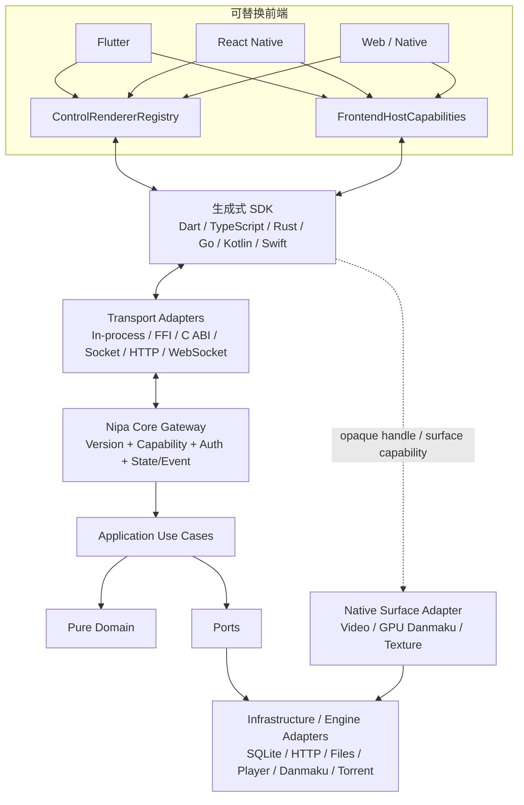

# NipaPlay 前后端解耦与可替换运行时迁移路线图

> 状态：草案 / 待执行  
> 审计日期：2026-07-14  
> 审计基线：`89050db2` 加当前工作区未提交修改  
> 目标：后端实现语言可替换，前端框架可替换；前端只需实现协议客户端、注册语义控件 renderer 和宿主能力，即可运行同一套 NipaPlay 业务。

## 1. 执行结论

当前项目已经具备 `Service`、`Provider`、播放器/弹幕适配器、`Unified*` 页面描述和内置 Web API 等过渡结构，但它们主要是 **Flutter/Dart 进程内部的抽象**。它们还不是稳定的跨语言、跨进程、跨前端协议。

当前主调用路径仍然是：

```text
Flutter Widget / State
  -> Provider / ChangeNotifier / static Service
  -> SharedPreferences / SQLite / HTTP / File / MethodChannel / FRB
```

目标调用路径应变成：

```text
任意前端
  -> 生成式 SDK + ControlRendererRegistry + HostCapabilities
  -> 可替换 Transport
  -> 版本化 Core Gateway
  -> Application Use Cases / Domain
  -> Ports
  -> 任意语言或技术实现的 Adapters
```

这次迁移采用渐进式替换，不进行一次性重写。现有 Dart 业务先被包进符合新协议的 legacy adapter；每迁移一个垂直切片，就切断该切片对旧 Service、Provider、Flutter 类型和静态单例的直接依赖。

## 2. 最终目标的准确含义

### 2.1 后端可更换语言

达到目标后，Dart、Rust、Go、Node 或其他语言实现只要：

1. 实现相同版本的协议；
2. 声明相同或兼容的 capabilities；
3. 通过同一套 conformance tests；
4. 遵守相同的状态机、错误码、事件顺序和数据迁移约定；

前端业务代码就不需要随实现语言变化。

如果后端作为独立进程部署，可以在不修改前端源码的情况下切换实现。如果后端以静态库或 FFI 方式嵌入移动应用，替换二进制实现通常仍需要重新打包应用，但不应要求修改前端业务代码。

### 2.2 前端可脱离 Flutter

达到目标后，Flutter、React Native、Web 或原生前端只负责：

- 渲染布局、主题、动画、无障碍和本地化文本；
- 将用户意图转换成协议 Command；
- 消费 Snapshot、Patch 和 Event；
- 注册语义控件的 renderer；
- 实现文件选择、权限、分享、窗口等前端宿主能力；
- 挂载视频、弹幕等本机高性能 Surface。

前端不得直接理解 SQLite、SharedPreferences、Jellyfin 原始 DTO、FRB 生成类、Dart Service 单例或 Flutter 后端状态对象。

### 2.3 “注册控件即可分配”的含义

后端或应用组合层下发的是受限、可版本化、可序列化的语义控件描述，而不是 Flutter Widget 名称或任意可执行 UI 代码。例如：

```json
{
  "id": "home.continue-watching",
  "type": "nipaplay.media.grid",
  "schemaVersion": 1,
  "props": {
    "resourceId": "history.continue-watching",
    "emptyTextKey": "home.continueWatching.empty"
  },
  "actions": [
    {"event": "itemPress", "command": "playback.prepare"}
  ],
  "requiredCapabilities": ["media.thumbnail.v1"]
}
```

各前端分别注册：

```text
Flutter:      nipaplay.media.grid@1 -> FlutterMediaGridRenderer
ReactNative:  nipaplay.media.grid@1 -> RNMediaGridRenderer
Web:          nipaplay.media.grid@1 -> WebMediaGridRenderer
```

复杂页面应优先注册业务组合控件，不应把协议扩张成另一套完整 Flutter/React Native Widget 框架。

## 3. 当前架构审计基线

以下数字用于衡量迁移是否真的减少耦合。后续每个阶段结束时必须重新生成基线。

| 指标 | 当前值 |
|---|---:|
| `lib/` Dart 文件 | 675 |
| UI 审计范围文件 | 302 |
| UI 直接依赖核心层 import | 453 行 / 135 文件 |
| UI 直接 import `services/` | 170 行 / 75 文件 |
| UI 直接 import `models/` | 108 行 / 50 文件 |
| UI 直接 import `providers/` | 133 行 / 77 文件 |
| UI 使用 `globals.` | 217 次 / 43 文件 |
| UI 使用 `Platform.` | 118 次 / 23 文件 |
| UI 直接 import `dart:io` | 29 文件 |
| UI 使用 SharedPreferences | 35 次 / 13 文件 |
| Service 文件 | 99 |
| Service import 任意 Flutter 包 | 75 文件 |
| Service import Material/Widgets/Cupertino | 17 文件 |
| Service 使用 `BuildContext` | 10 文件 |
| Service 使用 SharedPreferences | 32 文件 |
| Service 使用 `dart:io` | 43 文件 |
| Service 使用 HTTP/Dio | 28 文件 |
| Service 导入其他 Service | 45 文件 / 96 条边 |
| Service 单例模式 | 50 文件 |
| Provider 文件 | 20 |
| Provider 直接基础设施依赖 | 16 / 20 |
| Provider 直接 SharedPreferences | 10 文件 |
| Provider 直接发 HTTP | 4 文件 |
| Model 文件 | 22 |
| Model 混入 Flutter/存储/Service | 3 文件 |
| 全项目直接 SharedPreferences import | 72 文件 |
| 全项目直接 HTTP/Dio import | 49 文件 |
| 全项目直接 Platform 判断 | 70 文件 |
| 全项目 MethodChannel/EventChannel | 12 文件 |
| `Map<String, dynamic>` 所在文件 | 176 文件 |
| Repository / UseCase / DataSource 体系 | 0 / 0 / 0 |
| `lib/data`、`lib/features/*`、`lib/presentation` | 基本为空的迁移占位目录 |
| `VideoPlayerState` 及其 part | 13,571 行 |
| 契约/协议一致性测试 | 0 |

这些统计不是代码质量评分。它们的用途是防止“只调整目录或重命名类，但依赖方向没有改变”。

## 4. 可复用的现有基础

迁移应保留并升级下列已有设计，不应全部推翻：

- `AppPageComponent` 已有语义化页面组件 ID，可作为 Control Spec 的输入种子。
- `UnifiedAppPage` 已统一手机和桌面的主页面 ID、顺序与可用性定义。
- `PlayerMenuPaneId`、Category 和 Icon Token 已开始把菜单语义从具体图标中抽出。
- `PlayerRemoteControlBridge` 已能描述 bool、double、select、string、readonly 等参数，可演进为生成式 Command/State 协议。
- 播放器和弹幕已有多实现工厂，适合在其前方增加真正的跨语言 Port。
- Rust 文件扫描和 Torrent 已是可单独迁移的后端能力。
- C/C++ opaque handle 与显式释放函数是建立稳定本机 ABI 的良好起点。
- 内置 Shelf Web API 已证明应用可以通过传输层访问部分能力，可降级为新 Core Gateway 的一个 transport adapter。
- 插件 manifest、permission、event 和 UI entry 已有雏形，可迁移为独立 schema。

## 5. 未完全分离的架构债务清单

### D-01：Composition Root、启动编排与 UI 混在 `main.dart`

- `main.dart` 同时负责平台初始化、数据库、日志、播放器/弹幕内核、窗口、Web Server、ServiceProvider、Provider 注册、主题、拖放和主页面实现。
- `MainPageState` 仍位于入口文件；入口不是一个纯依赖装配层。
- 影响：无法独立启动 headless core，也无法为不同前端复用同一应用会话。
- 目标：创建独立 `CoreRuntime` 和纯 composition root；Flutter `main` 只装配 transport、host capabilities 和 renderer。

### D-02：全局变量、设备探测和 Navigator 是隐式依赖

- `lib/utils/globals.dart` 保存全局 Navigator、可变设置、MethodChannel 和启动设备画像。
- 设备类型主要在启动时固化，页面内仍大量直接访问 `globals.isPhone/isDesktop/isTablet`。
- 影响：依赖不可注入，窗口/折叠屏/外接显示器能力变化不能统一传播，非 Flutter 前端无法复用。
- 目标：可观察、可序列化的 `DeviceCapabilities` 与前端私有的 `NavigationHost`。

### D-03：所谓统一页面仍然直接构建 Flutter Widget

- `UnifiedAppPage` 保存 `IconData`、本地化闭包并提供 Widget build。
- `UnifiedAppControlRegistry` 是 enum 到具体 Flutter Page 的硬编码 `switch`，没有注册、卸载、版本或 fallback。
- `ThemeRegistry` 也是编译期 Flutter descriptor Map。
- 目标：把页面、窗口、Action 和 Control 定义迁为 schema；Widget 映射只存在于 Flutter renderer registry。

### D-04：`Unified*` ViewModel 仍不可序列化

- 设置定义保存 `BuildContext`、`IconData`、Widget builder 和 Provider 可见性函数。
- 下载 ViewModel 保存 `TextEditingController`、`VoidCallback` 和 `ValueChanged`。
- 其他统一模型仍包含前端闭包、硬编码显示字符串或 Flutter foundation 类型。
- 目标：只保留字段、token、binding、ActionRef、资源 ID 和 localization key。

### D-05：UI 直接调用 Service、Provider、Model 和基础设施

- 75 个 UI 文件直接 import `services`；典型高耦合文件包括首页、媒体库、详情页、下载页和播放器菜单。
- 页面自己加载数据、保存偏好、发 HTTP、访问文件、判断平台、维护 Timer 和业务缓存。
- 目标：Widget 只消费不可变 `ScreenState`，只发出 `Command/Intent`；不得访问持久化、网络或领域 Service。

### D-06：手机与桌面共享页面 ID，但不共享应用状态宿主

- 桌面 `MainPageState` 与手机 `CupertinoMainPageState` 分别维护页面选择、监听器、功能可见性和生命周期。
- 桌面预创建页面，手机切换时可能让 StatefulWidget 离树重建。
- 目标：独立于 renderer 的 `ApplicationSession`、`FeatureStore` 和 `PageSession`；renderer 切换不得触发业务重载。

### D-07：Flutter Material 与 Cupertino renderer 互相反向依赖

- Cupertino 主题直接使用 Nipaplay 主题组件，Nipaplay 主题也直接使用 Cupertino sheet、dialog 和 toolbar。
- 目标：两个 renderer 零互相 import；共用视觉 primitive 放入独立 Flutter-only primitives 包，业务语义放 contracts。

### D-08：Provider 同时承担状态、Repository、网络、持久化和业务编排

- 20 个 Provider 中 16 个直接依赖基础设施。
- `WatchHistoryProvider` 同时访问 SQLite、文件、ScanService 和 Web API。
- Jellyfin、Emby、Dandanplay、共享库 Provider 内有 Web/Native 分支和直接 HTTP。
- 目标：Provider 降为薄 Flutter binding；真实 Store/UseCase 不 import Flutter，也不直接持久化。

### D-09：Model、数据库、迁移和同步混在同一层

- `WatchHistoryManager` 同时承担实体、静态缓存、JSON 文件、SQLite 迁移和同步触发。
- `WatchHistoryDatabase` 位于 `models` 并直接处理文件、FFI、Preferences 和迁移。
- 远程共享模型在 `fromJson` 中按 Web 平台改写 URL。
- 目标：区分 Domain Entity、供应商 DTO、Contract Message、View State、Repository Port 和 Adapter。

### D-10：供应商 DTO 直接成为前端领域模型

- Jellyfin、Emby、Bangumi/Dandanplay 的原始字段、大小写和 URL 进入共享 Model 和 UI。
- Jellyfin/Emby Provider、Service、匹配器存在大量平行代码。
- `jellyfin://`、`emby://`、`webdav://`、`smb://` 字符串协议散落在业务判断中。
- 目标：供应商 DTO 只允许存在于 adapter；核心使用统一 `MediaItem/MediaSourceRef/PlaybackSource`。

### D-11：Service 是巨型混合层，并形成横向依赖网

- Service 混合 HTTP、缓存、偏好、重试、平台、业务规则和状态通知。
- 45 个 Service 直接导入其他 Service，Service 与 Provider 还存在双向依赖。
- 扫描、媒体服务器、备份、弹弹play、WebDAV、SMB 等模块均有此问题。
- 目标：Application Use Case 负责编排；Port 描述依赖；Adapter 只实现单一外部能力。

### D-12：Service 反向依赖 Flutter UI

- PlaybackService 直接导航和读取 Provider。
- 自动下一集、匹配、退出、扫码、外部播放器等 Service 接收 `BuildContext` 或显示 Dialog/Snackbar。
- Jellyfin/Emby matcher 甚至在 Service 文件中声明完整 Widget。
- 目标：Service 只返回结果或发布 `UiEffect`；Navigator/Dialog/Snackbar 由前端消费。

### D-13：静态 Service Locator 和单例阻止实现替换

- `ServiceProvider` 静态创建 Provider 与 Service。
- 约 50 个 Service 使用 `instance` 或工厂单例；工厂内部又读取 SharedPreferences 和平台状态。
- 目标：所有实例只在 composition root 创建；构造函数依赖 Port；测试、legacy、Rust 或远程实现可注入替换。

### D-14：`VideoPlayerState` 是 UI、业务和基础设施的超级对象

- 主文件和 part 合计 13,571 行。
- 同时包含 Flutter Widget/Navigator、播放器实例、网络、数据库、Preferences、文件、字幕、弹幕、同步、平台窗口、屏幕亮度和音量逻辑。
- `PlayerRemoteControlBridge` 也直接绑定该 Flutter 状态对象。
- 目标：拆为 `PlaybackSession` 状态机、Use Cases、Engine Port、Preference Port、Sync Port、Host Effect 和前端 Store。

### D-15：播放器抽象仍是 Flutter SPI，不是跨语言协议

- `AbstractPlayer` 暴露 Flutter `ValueListenable`。
- Player wrapper 返回 Widget、Rect、VideoPlayerController，并通过 `dynamic` 探测实现能力。
- Factory 同时负责 Preferences、平台判断和具体实例创建。
- 目标：定义语言无关的 `PlayerSession` Command/State/Event；Surface 通过 opaque handle/capability 单独挂载。

### D-16：弹幕领域、布局算法和 Flutter 渲染没有分开

- `DanmakuContentItem` 使用 Flutter `Color`。
- `DanmakuTextRenderer` 接收 `BuildContext` 并返回 Widget。
- Overlay 通过巨型 `switch` 选择 CPU/GPU/Canvas/C++/Rust 实现。
- 目标：纯 `DanmakuItem`、`DanmakuLayoutEnginePort`、帧数据协议和每个前端的 Presenter/Surface adapter。

### D-17：FRB、MethodChannel 和手写 FFI 被当成公共契约

- FRB 生成类只能直接被 Dart/Flutter 消费。
- Torrent Rust API 多处返回 JSON 字符串；Next2 用松散 Map/JSON 和 Flutter 类型拼装数据。
- MethodChannel 名称、方法名和 Map payload 缺少 schema、版本和 capability negotiation。
- C ABI 尚缺统一 ABI 版本协商、`struct_size`、保留字段、线程模型和签名漂移测试。
- 目标：这些全部降级为 transport/engine adapter；公共契约由独立 IDL/schema 定义。

### D-18：平台能力散落在 Service、Utils、Widget 和原生 Runner

- 文件选择、SAF、照片、分享、安全书签、关联文件、窗口、托盘和视频纹理分别使用不同字符串 Channel。
- 目标：统一 `FrontendHostCapabilities`；Flutter、React Native、Web 和原生前端各自实现，Core 只请求语义 effect。

### D-19：内置 Web API 不是稳定的 NipaPlay 后端协议

- 路由无统一 `/v1`、schema、生成客户端、能力协商或统一错误 envelope。
- Shelf Controller 直接访问 ServiceProvider、Provider、文件系统和具体 Service。
- `Map<String, dynamic>` 与手工 JSON 映射大量存在。
- 目标：schema-first 的 Core Gateway；Shelf 只是其 HTTP/WS adapter。

### D-20：Web/Native 差异被写进 Provider 和业务 Model

- 多个 Provider 通过 `kIsWeb` 决定直接调用本地 Service 还是远程 HTTP，再手工映射不同数据。
- 目标：前端只依赖同一 `BackendClient`；差异由 `EmbeddedTransport` 与 `RemoteTransport` 处理。

### D-21：插件系统混合运行时、存储、网络、业务、权限和 Flutter UI

- PluginService 保存静态 `dynamic playerState` 和 `BuildContext`。
- 插件桥通过字符串 switch 直接控制 Flutter VideoPlayerState、UI 和 Preferences。
- manifest 缺少 schemaVersion、运行时兼容范围、UI slot、控件版本和签名信息。
- UI entry 只支持 action/switch/text，Event 只有字符串和 Map。
- 部分权限主要在注入的 JS wrapper 检查，宿主分发端必须增加不可绕过的强制校验。
- 目标：插件只注册 feature/action/state/control；宿主端强制权限、配额、取消、超时和隔离。

### D-22：设置、凭据、备份和本地化边界不清

- 72 个文件直接 import SharedPreferences，设置 key 和 enum index 分散。
- WebDAV、SMB、媒体服务器凭据由普通 Preferences/JSON 模型持有。
- 备份通过扫描 key 前缀推断数据分类。
- 核心/统一模型中存在硬编码中文显示文本。
- 目标：Typed Settings Schema、CredentialVaultPort、版本化 Backup Schema；核心返回 localization key + args。

### D-23：错误、取消、重试、事件顺序和状态恢复没有统一协议

- 异常常被转换成自由文本或 `Map<String,dynamic>`。
- Event 缺少 eventId、sequence、revision、重放和背压约定。
- 长任务缺少统一 commandId、取消、幂等键和恢复查询。
- 目标：稳定错误码、请求关联 ID、幂等语义、Snapshot + Revision + Patch/Event 流。

### D-24：安全边界不足以直接开放可替换远程后端

- LAN API 需要统一 pairing/session、scope、限流、body 上限和审计。
- Web UI proxy 可代理任意 HTTP/HTTPS 并转发请求头，存在 SSRF、开放代理和凭据转发风险。
- Rust Torrent Range 服务也需要短期 token、生命周期和访问范围约束。
- 目标：安全问题作为 P0 阻断项，未完成前不得把内部 API 宣告为正式 Core Gateway。

### D-25：测试只能证明 Flutter/Dart 内部行为

- 现有测试没有 contract fixture、跨语言 codec、transport conformance 或第二前端测试。
- 部分架构测试通过读取源码字符串断言实现细节，不能证明协议兼容性。
- 目标：同一 conformance suite 覆盖 legacy、fake、Rust/第二语言及 embedded/remote transport。

### D-26：仓库和包结构仍以单体 Flutter 应用为中心

- `lib/data`、`lib/features/*` 和 `lib/presentation` 尚未承载真实分层。
- Core、Contracts、Adapters、Frontend 无独立发布/编译单元。
- 目标：形成可单独构建的 contracts、core、adapter 和 frontend workspace。

## 6. 目标架构



### 6.1 允许的依赖方向

```text
frontend renderer -> generated contracts/sdk
frontend binding  -> application client interface
application       -> domain + ports
adapters           -> ports + generated contracts
transport          -> generated contracts + gateway
domain             -> 标准库或纯语言基础包
```

禁止：

```text
domain/application -> Flutter / React Native / Provider / Widget
domain/application -> SQLite / SharedPreferences / HTTP / File / MethodChannel / FRB
service/adapter     -> page / widget / theme / Navigator / BuildContext
frontend            -> concrete service / database / supplier DTO
renderer A          -> renderer B
```

### 6.2 建议的目标仓库结构

```text
contracts/
  proto/nipaplay/v1/
  ui-schema/v1/
  plugin-schema/v1/
  fixtures/
  generated/
core/
  domain/
  application/
  ports/
  gateway/
adapters/
  legacy_dart/
  rust/
  persistence_sqlite/
  media_jellyfin/
  media_emby/
  webdav/
  smb/
  platform/
frontends/
  flutter/
  react_native_reference/
tools/
  architecture_checks/
  conformance/
```

在迁移初期可以先放在 `packages/` 下，等依赖边界稳定后再移动现有 Flutter app，避免为了目录美观造成大规模无功能变更。

### 6.3 协议技术决策

推荐：

- 业务 Command、Query、State、Event：以 Protobuf 为唯一事实源，生成 Dart、TypeScript、Rust、Go、Kotlin、Swift 类型。
- 动态 Control Spec、Plugin Manifest：使用带版本的 JSON Schema，便于插件和远程调试。
- HTTP 控制面：版本化 `/v1`，可采用 Connect/JSON transcoding；不得手写一套与 IDL 不一致的 Map。
- Event：WebSocket、server stream 或等价传输，但必须使用同一 Event schema。
- 媒体数据面：HTTP Range、共享内存、二进制 buffer 或 native surface；不得把视频帧塞进普通 JSON RPC。
- 本机高性能边界：C ABI/FFI，增加 ABI version、capability、`struct_size`、线程、所有权和释放规则。

如果团队不采用 Protobuf，最低替代方案是 OpenAPI 3.1 + AsyncAPI + 共享 JSON Schema；无论选哪种，都必须先改 schema，再生成代码，禁止继续以手写 `Map<String,dynamic>` 作为公共接口。

### 6.4 Core Gateway 最小能力

```text
System.NegotiateProtocol
System.GetCapabilities
Settings.Get / BatchSet / Watch
History.List / Upsert / Delete / Watch
Media.ListLibraries / Query / GetDetail
MediaSource.Browse / ResolvePlayback
Scan.Start / Cancel / GetState
Playback.CreateSession / Prepare / Command / GetState / Subscribe
Danmaku.Search / Match / Load / Send
Account.Connect / Disconnect / GetState
Download.Add / Command / List / Watch
Backup.Export / Import
View.GetSpec
Events.Subscribe
```

统一 envelope 至少包含：

```text
request:  protocolVersion, requestId, method, deadline, idempotencyKey, payload
response: requestId, revision, data | error(code, messageKey, details, retryable)
event:    eventId, sequence, revision, timestamp, type, payload
```

### 6.5 首批核心 Ports

- `WatchHistoryRepository`
- `SettingsRepository`
- `CredentialVaultPort`
- `MediaCatalogRepository`
- `MediaServerGateway`
- `RemoteFileSystemPort`
- `DanmakuGateway`
- `BangumiGateway`
- `PlaybackEnginePort`
- `DownloadEnginePort`
- `FileScannerPort`
- `ThumbnailStore`
- `BackupStore`
- `NetworkTransport`
- `Clock`
- `IdGenerator`
- `EventPublisher`
- `FrontendHostCapabilitiesPort`

### 6.6 Control Registry 最小模型

```text
ControlNode {
  id
  type
  schemaVersion
  slot
  props
  styleTokens
  stateBindings
  actionBindings
  children
  visibility
  requiredCapabilities
  layoutHints
  accessibility
  localizationKeys
}
```

首版内置控件建议：

- page、section、stack、grid、list；
- text、image、mediaCard；
- button、toggle、slider、select、textInput、progress；
- videoSurface、danmakuSurface；
- unknown/fallback。

必须满足：

- 后端不发送 Widget 名、平台组件名或闭包；
- Action 只引用稳定 command ID；
- 图标使用语义 token；
- 文本使用 localization key + args；
- 未知控件显示安全 fallback 并上报 capability mismatch；
- required control 在启动协商时缺失，应阻止进入相关页面并给出可诊断错误；
- 插件不能绕过 registry 注册任意原生执行代码。

### 6.7 视频和弹幕的特殊边界

播放器不能简单全部远程化。必须拆为：

1. 控制面：Prepare、Play、Pause、Seek、Track、State、Event；
2. 媒体数据面：Range URL、buffer 或解码输入；
3. 本机呈现面：texture/surface/opaque handle；
4. 宿主生命周期：attach、resize、detach、foreground/background；
5. 弹幕布局面：纯 item + layout output；
6. 弹幕呈现面：Flutter Canvas、RN Fabric/JSI、Web Canvas/WebGPU 或 native GPU adapter。

高频路径必须有二进制协议、共享内存或 surface 方案，不能逐帧传未版本化 JSON。

## 7. 待办执行流程

### 7.1 单个待办的标准流程

每个待办必须按以下顺序执行：

1. 关联一个 `D-xx` 架构债务和一个可观察用户流程；
2. 添加 characterization/golden tests，冻结现有行为；
3. 先定义或扩展 contract，并生成客户端/服务端类型；
4. 定义 Port 和 fake/in-memory 实现；
5. 用 legacy adapter 包装现有代码；
6. 将一个 consumer 切换到新边界；
7. 必要时 shadow read、dual write 或并行比对；
8. 通过 contract、integration、UI 和数据迁移测试；
9. 删除该切片的旧直连路径；
10. 更新本文基线、依赖图和完成状态。

禁止在一个 PR 中同时迁移多个高风险领域。正常 PR 应只包含一个 contract 变更、一个 adapter 或一个垂直切片。

### 7.2 状态定义

| 状态 | 含义 |
|---|---|
| TODO | 未开始，依赖条件可能尚未满足 |
| READY | contract、owner、验收标准和依赖已明确 |
| IN_PROGRESS | 正在实现；只能有一个明确主路径 |
| BLOCKED | 阻断原因和解除条件已记录 |
| VERIFYING | 实现完成，正在跑一致性/迁移/性能测试 |
| DONE | 旧路径已删除，退出门槛全部满足 |

## 8. 分阶段 TODO

## P0：安全、冻结边界与基线

- [ ] `P0-01` 编写 ADR：协议事实源、版本策略、embedded/remote transport、Control Schema 和插件信任模型。
- [ ] `P0-02` 建立 endpoint、command、event、setting key、MethodChannel、FFI/FRB API、control ID 全量清单。
- [ ] `P0-03` 把第 3 节统计做成 `tools/architecture_checks` 可重复脚本并在 CI 输出趋势。
- [ ] `P0-04` CI 禁止新增 UI -> Service/Provider/IO 直连，先采用“不得高于基线”的 ratchet，再逐步降到 0。
- [ ] `P0-05` CI 禁止新建 Service 使用 BuildContext/Widget/Navigator/Theme/Dialog/Snackbar。
- [ ] `P0-06` 为现有 API、Channel、FRB 和插件 payload 建立 golden fixtures。
- [ ] `P0-07` 给 LAN API 增加统一 pairing/session、scope、CORS allowlist、限流、body 上限和审计日志。
- [ ] `P0-08` 限制 Web UI proxy 的 scheme、host、端口、私网范围和敏感 header，加入 SSRF/开放代理测试。
- [ ] `P0-09` 为 Torrent Range endpoint 增加短期 token、绑定范围和生命周期清理。
- [ ] `P0-10` 记录启动、列表、播放控制和弹幕高频路径的性能基线。

退出门槛：

- 所有现有外部/内部接口均有稳定 ID、owner 和 fixture；
- 未认证客户端不能修改设置、读取凭据或使用任意代理；
- 新 PR 无法继续增加已知逆向依赖；
- 本阶段不要求改变用户可见功能。

## P1：语言中立 Contracts 与生成式 SDK

- [ ] `P1-01` 创建 `contracts/proto/nipaplay/v1` 和包级版本规则。
- [ ] `P1-02` 定义 Meta、Version、Capability、Request/Response、Error 和 Event envelope。
- [ ] `P1-03` 定义 cancellation、deadline、idempotency、revision、snapshot/patch 和重连续传规则。
- [ ] `P1-04` 定义 System、Settings、History 的首批协议。
- [ ] `P1-05` 定义 Media、MediaSource、Playback、Danmaku、Download 的 ID 与基本消息，不必一次实现全部方法。
- [ ] `P1-06` 创建 `ui-schema/v1`：ControlNode、PageSpec、ActionRef、Binding、Capability 和 fallback。
- [ ] `P1-07` 创建 `plugin-schema/v1`：manifest、permission、runtime、contribution、slot、control 和 event。
- [ ] `P1-08` 生成 Dart、TypeScript 和 Rust SDK；预留 Go/Kotlin/Swift 生成配置。
- [ ] `P1-09` 建跨语言 fixture/codec 测试和 schema backward-compatibility 检查。
- [ ] `P1-10` 将错误文本改成稳定 `errorCode + messageKey + args`，本地化在前端完成。

退出门槛：

- contracts 可在没有 Flutter SDK 的环境编译和测试；
- Dart、TypeScript、Rust 对同一 fixture 编解码一致；
- public contract 中不存在 Widget、Color、IconData、BuildContext、ValueListenable、Controller、闭包或 Dart-only 类型；
- unknown field 和 minor version 升级通过兼容测试。

## P2：Core Gateway、依赖注入与 Legacy Adapter

- [ ] `P2-01` 定义唯一前端入口 `BackendClient/CoreGatewayClient`。
- [ ] `P2-02` 实现 `LegacyDartCoreAdapter`，在不改行为的前提下包装现有 Service/Provider。
- [ ] `P2-03` 实现 `FakeCoreBackend`，供 UI、contract 和故障测试使用。
- [ ] `P2-04` 实现 `EmbeddedTransport` 与版本化 HTTP/WS transport，共用同一生成接口。
- [ ] `P2-05` 创建实例化 `AppKernel`；逐步替代 `ServiceProvider` 静态 Service Locator。
- [ ] `P2-06` 引入 `Clock`、Logger、IdGenerator、EventPublisher 和 CancellationToken Port。
- [ ] `P2-07` 建立 `ApplicationSession`，将页面选择之外的业务状态移出 Flutter Widget 生命周期。
- [ ] `P2-08` 建立 UiEffect/HostEffect 通道：Navigate、Toast、Confirm、FilePick、Permission、Share、Window。

退出门槛：

- Flutter 至少可通过 legacy、fake 两种 backend 运行一个只读页面；
- 相同测试可对 Embedded 与 HTTP/WS transport 执行；
- 已迁移 consumer 不直接引用具体 Service 或 Provider；
- Service 不再为已迁移流程直接操作 UI。

## P3：数据、设置、凭据与供应商 Adapter

- [ ] `P3-01` 建立 `SettingsRepository` 和 typed settings schema，迁移散落 key 与 enum index。
- [ ] `P3-02` 建立 `CredentialVaultPort`，迁移 WebDAV、SMB、Jellyfin、Emby、Dandanplay 凭据；普通配置只存 credential reference。
- [ ] `P3-03` 建立纯 `WatchHistory` Entity、Contract Message 和 `WatchHistoryRepository`。
- [ ] `P3-04` 实现 SQLite、Web remote、in-memory History adapter，并跑同一 repository contract tests。
- [ ] `P3-05` 将 JSON -> SQLite 迁移放入独立 migration adapter，禁止 Model 自己迁移。
- [ ] `P3-06` 建立 `MediaCatalogRepository` 和统一 MediaItem/Library/MediaSourceRef。
- [ ] `P3-07` 将 Jellyfin/Emby 原始 DTO 限制在各自 adapter，并合并公共 MediaServer Port。
- [ ] `P3-08` 为 Local/WebDAV/SMB/Shared/Dandanplay 实现相同媒体源 Port。
- [ ] `P3-09` 建立 `BackupStore` 与版本化 Backup Schema，不再扫描 Preferences key 前缀。
- [ ] `P3-10` 删除 Model -> Service、Provider -> HTTP/SQLite/File 的已迁移依赖。

退出门槛：

- History 与 Settings 在 SQLite、remote、memory 实现上通过相同 contract tests；
- 供应商 DTO、HTTP 状态码和原始 URL 不越过 adapter；
- 凭据不再进入普通设置 DTO、日志或明文备份；
- Flutter UI 不再直接读写 Preferences、SQLite 或媒体服务器 HTTP。

## P4：Application Use Cases 与可观察状态

- [ ] `P4-01` 实现 `ManageSettings`、`ListHistory`、`RecordProgress`、`DeleteHistory`。
- [ ] `P4-02` 实现 `ConnectMediaServer`、`ListUnifiedLibraries`、`BrowseMedia`、`GetMediaDetail`。
- [ ] `P4-03` 实现 `ResolvePlaybackSource`、`SelectNextEpisode`、`RecordPlaybackProgress`。
- [ ] `P4-04` 实现 `ScanLibrary`、`SyncWatchHistory`、`MatchDanmaku`。
- [ ] `P4-05` 实现 `ManageDownloads`、`ExportBackup`、`ImportBackup`。
- [ ] `P4-06` 把 Provider 降为 `BackendClient -> immutable state` 的薄 binding。
- [ ] `P4-07` 把业务 Timer、重试、缓存、分页、并发和取消移出 Widget State。
- [ ] `P4-08` 拆解 VideoPlayerState：Session State Machine、Use Case、Engine Port、Preference Port、Sync Port、UiEffect。
- [ ] `P4-09` 将远程控制 API 改为调用同一 Playback Commands，不再直接读写 Flutter VideoPlayerState。

退出门槛：

- application/domain 不 import Flutter、Provider、数据库、HTTP、File、MethodChannel 或 FRB；
- 同一 ApplicationSession 可被两个 renderer 订阅而不重复加载业务数据；
- 所有长任务支持取消、超时、稳定错误码和恢复查询；
- `Map<String,dynamic>` 不出现在公开 Use Case/Port 接口。

## P5：真正的 Control Renderer Registry

- [ ] `P5-01` 实现 Control Registry 的 `register/unregister/resolve/version/fallback`。
- [ ] `P5-02` 将 AppPage、VirtualWindow、Action、Settings Entry 从 Flutter 类迁到 schema。
- [ ] `P5-03` 将图标改为 semantic token，将文本改为 localization key。
- [ ] `P5-04` 将 Settings 控件迁为 toggle/select/slider/textInput/button/section。
- [ ] `P5-05` 将播放器菜单迁为同一 Parameter/Command schema，复用远程控制描述能力。
- [ ] `P5-06` 将首页、媒体库、账户、下载页面迁为 PageSpec + 业务组合控件。
- [ ] `P5-07` 建立 Material、Cupertino 两个独立 registry；禁止互相 import。
- [ ] `P5-08` 建 capability-driven layout profile，替代页面直接访问 Platform/globals。
- [ ] `P5-09` 建 unknown control、版本不兼容、缺失 required capability 的 UI 和日志测试。
- [ ] `P5-10` 将插件 UI contribution 接入同一个受限 registry。

退出门槛：

- Control descriptor 100% 可 JSON/IDL 序列化；
- 新增控件通过注册完成，不修改中央大 `switch`；
- Material、Cupertino renderer 互相零 import；
- 手机、桌面、电视使用相同 PageSpec 和 ApplicationSession；
- renderer 切换或窗口 capability 变化不触发业务数据重载。

## P6：播放器、弹幕、下载和原生 Runtime 边界

- [ ] `P6-01` 定义 `PlayerSession` 状态机、Commands、Events、Capabilities 和恢复语义。
- [ ] `P6-02` 将 ValueListenable、Widget、Rect、VideoPlayerController、dynamic 能力探测移出 Player Port。
- [ ] `P6-03` 定义 VideoSurface 生命周期和 opaque handle 协议。
- [ ] `P6-04` 定义纯 DanmakuItem、LayoutInput、LayoutFrame 和 Renderer capability。
- [ ] `P6-05` 将 Overlay 巨型实现 switch 替换为 Engine/Surface registry。
- [ ] `P6-06` 为 FileScannerPort 和 DownloadEnginePort 实现 legacy Dart/Rust adapter。
- [ ] `P6-07` 将 Rust Torrent JSON string 改为生成类型或版本化二进制消息。
- [ ] `P6-08` 给 C ABI 增加 ABI version、capability、`struct_size`、保留字段、线程和所有权规则。
- [ ] `P6-09` 为手写 FFI 加签名漂移检查和内存/句柄生命周期测试。
- [ ] `P6-10` 建高频路径性能预算，替换逐帧松散 JSON/Map。

退出门槛：

- 至少两个 Player backend 或一个真实 backend + 标准 mock 通过同一状态机测试；
- Rust 和 legacy 文件扫描/下载实现通过同一 conformance suite；
- Flutter 与第二前端能挂载 videoSurface/danmakuSurface；
- 控制面不泄漏 Flutter 类型，本机高频路径达到不低于 P0 基线的性能。

## P7：插件系统重构

- [ ] `P7-01` manifest 可在不执行插件代码的情况下完整解析和校验。
- [ ] `P7-02` 增加 schemaVersion、host API range、runtime、entrypoint、signature、capability 和 UI slot。
- [ ] `P7-03` 所有权限在宿主 dispatcher 强制检查，不能只依赖注入 JS wrapper。
- [ ] `P7-04` 运行时加入隔离、超时、取消、CPU/内存配额和崩溃熔断。
- [ ] `P7-05` 插件不再持有 BuildContext 或 dynamic VideoPlayerState。
- [ ] `P7-06` 插件仅通过 Command、Event、State、Control Contribution 与宿主交互。
- [ ] `P7-07` 插件控件使用内置 semantic controls；原生自定义 renderer 需要更高信任级别和签名。
- [ ] `P7-08` 为权限绕过、事件重放、未知控件、超时和恶意 manifest 建安全测试。

退出门槛：

- 绕过 JS wrapper 的权限攻击失败；
- 同一插件 contribution 可在 Flutter 与参考前端渲染；
- 插件异常或未知控件不影响主进程；
- PluginService 不 import Flutter UI，不保存 BuildContext/PlayerState。

## P8：第二后端与第二前端验收

- [ ] `P8-01` 选择第二后端语言，优先利用现有 Rust，至少实现 System、Settings、History、Media Query。
- [ ] `P8-02` 第二后端通过与 LegacyDartCoreAdapter 相同的 conformance suite。
- [ ] `P8-03` 建 React Native 或 TypeScript Web 参考前端，使用生成 SDK。
- [ ] `P8-04` 参考前端注册首批 controls，不复制后端业务规则。
- [ ] `P8-05` 在第二前端完成设置、历史、媒体列表、详情和播放准备。
- [ ] `P8-06` 完成 backend 切换、断线重连、版本不兼容和 capability 缺失测试。
- [ ] `P8-07` 比对 Flutter 与第二前端的同一 fixture/state/event 结果。

退出门槛：

- 相同 Flutter 前端可以连接 legacy Dart 和第二语言后端；
- Flutter 与第二前端可以连接相同后端；
- 切换后端不修改前端业务代码；
- 第二前端只实现 SDK、host capabilities 和 renderer registry，没有复制 Repository/Service 逻辑。

## P9：删除旧边界与仓库重组

- [ ] `P9-01` 删除已迁移 Provider 中的 HTTP、Preferences、File 和数据库访问。
- [ ] `P9-02` 删除 Service 中的 Flutter UI、Navigator、Dialog、Snackbar 和 BuildContext。
- [ ] `P9-03` 删除 ServiceProvider/static singleton 路径，保留 composition root 显式实例。
- [ ] `P9-04` 删除 globals 的业务状态和设备判断直连。
- [ ] `P9-05` 删除公开接口中的 `Map<String,dynamic>`、dynamic dispatcher 和手写重复 DTO。
- [ ] `P9-06` 移除旧的未版本化 `/api`、Channel 和桥接入口，或保留明确期限的兼容 adapter。
- [ ] `P9-07` 将 Flutter app 移入 `frontends/flutter`，Core/Contracts/Adapters 可独立构建。
- [ ] `P9-08` 更新贡献指南、插件开发指南、协议兼容策略和发布流程。

退出门槛：见第 11 节最终 Definition of Done。

## 9. 垂直切片迁移顺序

推荐按以下顺序迁移，前一个切片通过退出门槛后再开始下一个：

| 顺序 | 切片 | 原因 | 主要验证点 |
|---:|---|---|---|
| 1 | System/Capabilities | 无业务写入，先打通协议和 transport | 版本、能力、错误 envelope |
| 2 | Appearance/Settings | 控件类型简单，适合验证表单 registry | typed setting、toggle/select/slider |
| 3 | Continue Watching/History | 数据边界明确，可验证 Repository | SQLite/remote/memory 一致性 |
| 4 | Home Read Model | 以只读组合为主 | PageSpec、resource binding |
| 5 | Media Library Browse | 覆盖多供应商 adapter | 统一 Media DTO、分页、图片资源 |
| 6 | Account/Connections | 覆盖凭据和平台安全存储 | CredentialVault、错误码 |
| 7 | Downloads/Scan | 已有 Rust，实现语言替换证明成本较低 | cancellation、event、Rust adapter |
| 8 | Playback Commands/Menu | 已有远控参数描述雏形 | state machine、command schema |
| 9 | Video/Danmaku Surface | 生命周期和性能风险最高，最后迁移 | handle、GPU、帧协议、性能 |
| 10 | Plugins | 必须建立在稳定协议和 registry 之上 | 权限、贡献、隔离、跨前端 |

## 10. 每个模块的目标归属

| 现有模块 | 最终归属 |
|---|---|
| `models/*` 纯业务字段 | Domain Entity 或 Contract Message，二者分开 |
| Jellyfin/Emby 原始模型 | 对应 infrastructure adapter 私有 DTO |
| `providers/*` | Flutter binding；业务状态进入 Application Store |
| `services/*` 编排逻辑 | Application Use Case |
| `services/*` HTTP/File/DB | Infrastructure Adapter |
| `utils/settings_storage.dart` | Settings adapter |
| `models/watch_history_database.dart` | SQLite History adapter |
| `utils/video_player_state*` | Playback Session + Ports + Flutter Store/Effects |
| `player_abstraction/*` | PlaybackEnginePort + Flutter/native surface adapters |
| `danmaku_abstraction/*` | 纯 Danmaku Domain/Layout Port + renderer adapters |
| `src/rust/*` | Rust adapter 生成层，不允许被 UI 直接 import |
| MethodChannel 服务 | FrontendHostCapabilities 或 native adapter |
| `app/unified_*` | Control/Page/Action schema + frontend registry |
| `themes/cupertino` | Flutter Cupertino renderer |
| `themes/nipaplay` | Flutter Material/Desktop renderer |
| `plugins/*` | Plugin host + schema-generated contribution API |
| Shelf Web API | Core Gateway 的 HTTP/WS transport adapter |

## 11. 最终 Definition of Done

只有以下条件全部满足，才能宣告达到“后端可替换语言、前端可脱离 Flutter”：

1. `contracts`、`domain`、`application` 对 Flutter、Provider、数据库、HTTP、文件、平台 API、MethodChannel 和 FRB 的依赖为 0。
2. Flutter presentation 对 SharedPreferences、SQLite、HTTP/Dio、`dart:io`、MethodChannel、具体 Service 的直接依赖为 0；仅 host adapter 允许平台依赖。
3. Service/UseCase 中 `BuildContext`、Widget、Navigator、Theme、Dialog、Snackbar 为 0。
4. renderer 之间零互相 import；Material、Cupertino、React Native/Web 各自独立注册控件。
5. 应用层全局单例为 0；实例只在 composition root 创建。
6. 公共业务接口中 `Map<String,dynamic>` 为 0；Map 仅允许在 adapter 内部解码或生成代码内部使用。
7. 所有 API 有版本、能力协商、统一错误结构、认证和生成客户端。
8. Control descriptor 完全可序列化，不含闭包、Widget、IconData、Controller 或框架对象。
9. 新增 control type 只需 schema 声明和 renderer 注册，不修改中央 switch。
10. 未知/不兼容控件有安全 fallback；缺失 required capability 可诊断且不崩溃。
11. 同一 ApplicationSession 在手机、桌面、电视、窗口变化或 renderer 切换时不重新加载业务数据。
12. Legacy Dart 与第二语言后端通过 System、Settings、History、Media、Playback 的同一 contract tests。
13. Embedded 与 Remote transport 可互换，前端业务代码不变。
14. Flutter 与第二前端都能完成：启动协商、设置、登录/连接、媒体列表、详情、历史、播放准备和基础播放控制。
15. 视频/弹幕高频路径不使用未版本化逐帧 JSON，并达到不低于迁移前基线的性能。
16. 插件宿主端强制权限；插件不持有 BuildContext 或 Flutter PlayerState。
17. 凭据进入安全仓库，普通 DTO、日志和默认备份不包含明文 secret。
18. 数据升级、回滚和旧用户迁移通过真实副本测试。
19. 旧 Provider/Service/静态 Manager/未版本化 API 路径已删除或有明确移除版本。
20. CI 的依赖图、schema 兼容、contract、security 和 conformance checks 全部通过。

## 12. 架构 Ratchet 指标

迁移期间不要求第一天全部归零，但每次合并不得让以下数字上升：

- UI -> services/providers/models/globals/IO 直连文件数；
- Service -> UI 的反向 import 数；
- Service 中 BuildContext/Widget 数；
- Provider 中 Preferences/HTTP/File/DB 依赖数；
- 应用层 singleton 数；
- 公共接口 `Map<String,dynamic>` 数；
- 未版本化 endpoint/channel/command 数；
- renderer 之间的交叉 import 数。

每完成一个垂直切片，对应指标必须下降并删除旧路径，不能长期保留新旧两套主实现。

## 13. 风险与约束

### 13.1 不做“大爆炸重写”

新协议先包住旧实现，再逐个切片替换。任何阶段都要保持可发布状态，并保留可回滚的 adapter 开关。

### 13.2 不把后端驱动 UI 扩张成第二套 Widget 框架

Control Schema 只描述稳定语义、数据 binding、Action 和有限 layout hint。像复杂播放器舞台、图表或原生扫描器应注册成前端组合控件。

### 13.3 视频/GPU 不能只依赖普通 RPC

控制面可以跨进程；高频帧和 surface 生命周期必须有本机专用通道。远程后端需要提供 Range/stream，而不是把 texture handle 跨机器传递。

### 13.4 状态迁移与重连必须先设计

播放器、下载、扫描和插件都有长生命周期。协议必须先定义 session ID、revision、恢复、取消、幂等和事件重放，再迁移实现。

### 13.5 安全优先于开放远程能力

未完成 P0 安全门槛前，不得把内置 LAN API 视为通用后端接口，也不得允许外部后端拿到无限制文件路径、凭据或代理能力。

## 14. 进度记录模板

每个切片在本文件末尾追加：

```markdown
### YYYY-MM-DD / Slice ID

- 状态：READY | IN_PROGRESS | BLOCKED | VERIFYING | DONE
- 负责人：
- 关联债务：D-xx
- Contract 版本：
- Backend 实现：
- Frontend renderer：
- 删除的旧依赖：
- Contract tests：
- 数据迁移测试：
- 性能变化：
- 安全检查：
- 回滚方式：
- 后续事项：
```

## 15. 首个建议实施批次

第一批只执行以下内容，完成后再扩展范围：

1. `P0-01` 至 `P0-10`：冻结边界和修复远程安全阻断项；
2. `P1-01` 至 `P1-04`、`P1-08`、`P1-09`：建立最小 System/Settings/History 协议；
3. `P2-01` 至 `P2-04`：建立 legacy/fake backend 和统一 client；
4. 迁移 Appearance Settings 只读/写入切片；
5. 迁移 Continue Watching/History 切片；
6. 用一个 TypeScript CLI 或极简 Web 页面验证同一 SDK；
7. 复盘协议后，才开始媒体库和 Control Registry 的大规模迁移。

第一批的成功标准不是目录变漂亮，而是：

- Flutter 设置页和历史页不再直接使用 Preferences/SQLite/Service；
- fake、legacy backend 对同一 fixture 返回一致结果；
- TypeScript 客户端能读取和修改同一设置、读取同一历史；
- CI 能阻止新代码重新绕过协议边界。
